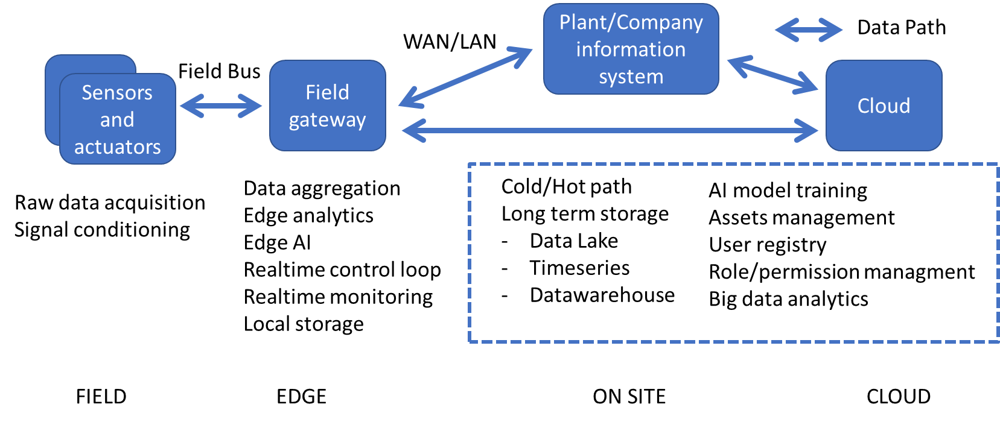

# Progetto Ultrasonic Vision
Ultrasonic Vision è un sistema di acquisizione dati in grado di rilevare la presenza di un oggetto, determinarne la posizione e riconoscere il tipo oggetto. Il sistema utilizza dei misuratori di distanza ad ultrasuoni dei modelli di classificazione addestrati con tecniche di machine learning.

L'obiettivo del progetto è quello di progettare e realizzare un primo prototipo funzionante del sistema con lo scopo di valutare la fattibilità del progetto ed individuare le criticità che dovranno essere affrontate nelle realizzazione delle successive versioni del sistema.

## Sommario
- [Progetto Ultrasonic Vision](#progetto-ultrasonic-vision)
  - [Sommario](#sommario)
  - [Come utilizzare il sistema](#come-utilizzare-il-sistema)
- [Il sitema Ultrasonic Vision](#il-sitema-ultrasonic-vision)
  - [Architettura](#architettura)
  - [Funzionamento del sistema](#funzionamento-del-sistema)
  - [Limitazioni note](#limitazioni-note)
  - [Il prototipo realizzato](#il-prototipo-realizzato)
  - [Contenuto del Repository](#contenuto-del-repository)
  - [Roardmap del progetto](#roardmap-del-progetto)
  - [Futuri Sviluppi](#futuri-sviluppi)

## Come utilizzare il sistema

TBC.

# Il sitema Ultrasonic Vision

Il sistema adotta una architettura di tipo _Edge computing_: in cui l'elaborazione è eseguita quanto più possibile vicino alla sorgente dei dati. Anche la componente di intelligenza è eseguita sul campo  per la parte di inverenza (_Edge AI_), mentre l'addestramento dei modelli è eseguito su cloud (_cloud computing_) oppure su server raggiugibili tramite rete LAN/WAN (_fog computing_) per sfruttare le maggiori risorse computazionali disponibili.

## Architettura 
L'architettura di riferimento è a quattro livelli

1. sensori ed attuatori che interagiscono direttamente con il mondo fisico sul campo
2. gateway di campo (_edge_) che raccoglie i dati di tutti i sensori, esegue le elaborazioni a livello di edge computing e gestisce le comunicazioni con l'esterno
3. sistema informativo dell'impianto produttivo o dell'organizzione (MES, ERP, SCADA, databse, servizi enterprise, .... )
4. applicazione e servizi su cloud (_cloud computing_) usate principalmente per l'addestramento del modelli di machine learning e lo stoccaggio dei dati a lungo termine

## Funzionamento del sistema

La componete di campo utilizza dei misuratori di distanza ad ultrasuoni. Ogni misuratore è indipendente ed è composto da un emettitore di impulsi ad ultrasuoni e da un ricevitore. La distanza del bersaglio viene stimata misurando il tempo (_Time Of Flight - TOF_) trascorso tra l'emissione dell'impulso e la ricezione del primo eco riflesso dal bersaglio.

I misuratori sono sono fissi ed in posizioni note. L'insieme delle distanze stimate rispetto ai diversi misuratori, combinato con le informazioni sulla configurazione geometrica del sistema,  viene utilizzato per stimare la posizione del bersaglio ed riconoscere  il tipo di oggetto. L'aggregazione e la prima elaborazione dei dati provenienti dai sensori viene eseguita localmente a livello di _edge_ (_edge computing_). A questo livello viene elaborata la stima della posizione e può essere eseguita anche la classificazione del oggetto. I dati acquisiti vengono poi inviati alla componente _cloud_ per elaborazioni di secondo livello, miglioramento del modello di classificazione e memorizzazione a lungo termine (_cloud computing_).

Il riconoscimento dell'oggetto viene eseguito utilizzando un classificatore multiclasse addestrato con dati ottenuti da misurazioni precedentemente eseguite con il sistema nella stessa configurazione (numero e posizione dei sensori) su oggetti noti a priori. Il classificatore può essere eseguito localmente sul dispositivo di campo che gestisce i sensori, come web server su rete locale oppure come web server remoto. 

In generale la configurazione geometrica del sistema ed il numero di sensori devono essere scelta in base ai requisiti di simmetria e risoluzione che si vogliono soddisfare. Nel caso del prototipo realizzato per questo progetto non erano stati posti  particolari vincoli e quindi sono stati utilizzati i sensori che erano disponibili in laboratorio, sperimentando diverse configurazioni geometriche. 

## Limitazioni note

**Il numero dei sensori utilizzabili** (e quindi la risoluzione spaziale del sistema) è limitato dal numero di linee di input/output digitale (_GPIO_)  del microcontrollore utilizzato e dal tempo disponibile per effettuare la misura (i misuratori vengono accesi singolarmente in sequenza). Solitamente i sensori ad ultrasuoni richiedono 2 linee (anche se alcuni modelli ne richiedono solo una). Nel caso del prototipo sono stati utilizzati dei sensori HC-SR04 che richiedono 2 GPIO e un Raspberry PI 3 mette a disposizione 24 GPIO quindi il prototipo, senza circuiteria aggiuntiva per multiplexing, può gestire fino a 12 sensori.

**Il raggio d'azione** del sistema dipende dalla configurazione geometrica del sistema e dalle caratteristiche dei misuratori utilizzati. Molti misuratori commerciali a bassa costo hanno una portata operativa di 2-3 metri anche se ne esistono alcuni con portata fino 7 metri.  Ad esempio disponendo i misuratori ai vertici e lungo i lati di un quadrato di potrebbe agevolmente coprire un area di almeno 2 mq anche con misuratori di fascia economica. Un altra possibilità è quella di disporre i misuratori lungo un circonferenza di diametro minore o uguale alla portata massima dei dispositivi.

**La classificazione degli oggetti dipende sia dalla geometria dell'oggetto che dalla posizione dell'oggetto all'interno dell'area di rilevamento**.  I classificatori addestrati fino ad ora hanno performance molto elevate se gli oggetti vengono posizionati esattamente come durante la fase di training, ma non riescono ad riconoscere l'oggetto in maniera indipendente dalla posizione. Questo problema è affrontato nel progetto [Ultrasonic Object Recognition](https://github.com/emanbuc/ultrasonic-object-recognition) che ha come obiettivo la realizzazione di un sistema di riconoscimento degli oggetti basato sui misuratori ad ultrasuoni utilizzando tecniche di machine learning e deep learning avanzate.

## Il prototipo realizzato

 [Prototipo del sistema di misura Ultrasocin Vision - versione 1.0](docs\prototipo_versione_01.md) 

## Contenuto del Repository

Il repository ufficile del progetto è un repository pubblico ospitato su GitHub  https://github.com/emanbuc/ultrasonic-vision. Il contenuto comprende:

- Documentazione del progetto 
  - [Diario giornaliero](activity_log.md) con descrizone dettagliata delle attività svolte
  - [Guida alla configurazione dell'Raspberry PI](docs/raspberry_setup.md) per lo sviluppo e l'utilizzo del sistema
  - [Guida utilizzo desktop remoto da Windows a Raspian](docs/raspbery_xrdp.md)
  - [Installazione Python 3.8 su Raspberry]()
  - [Cablaggio dei moduli HC-SR04](docs/raspberry_wiring_HC-SR04.md)
  - [Gestione evento "pulsante premuto" su Raspberry](docs/raspberry_button_pressed.md)
  - [Classificatore con Azure AutoML](docs/azure_autoML.md)
  - [Classificatore con SciKit Learn](docs/training_scikit-learn_model.md)
  - [Edge AI]()
- [Dataset](datasets/) per l'addestramento dei classificatori
- [Modelli ML addestrati](models/) e pronti all'uso per la classificaizone degli oggetti
- Notebook Jupyter per l'analisi dei dati, feature engineering e addestramento dei classificatori
  - [Analsi dati acquisiti dai sensori](notebooks/analisi_dati_sensori.ipynb)
  - [Conversione modelli in formato ONNX](notebooks/convertoToONNX.ipynb)
  - [Preparazione dataset per addestramento](notebooks/create_training_dataset.ipynb)
  - [Scikit-Leanr Model Training](notebooks/model_training.ipynb)
  - [Azure AutoML Model Training](notebooks/ultrasonic-vision-train-automl.ipynb)
  - [Rimozione Outliear](notebooks/remove_outlier.ipynb)
- [Alcuni esempi di dati prodotti](sample_acquisitions/) dal sistema nelle diverse configurazioni geometriche
- Software Python3:
  - [Modulo FakeRPi](src/FakeRPi) per eseguire il software senza l'hardware di acquisizione dati
  - [Applicazione console ultrasonic-vision](src/ultrasonic-vision.py)
- Vari script sviluppati durante il progetto
  - [Conversione dei modelli addestrati ](src/samples/convertToONNX.py) per formato SciKitLearn a formato ONNX
  - [Salvataggio dati su file CSV](src/samples/write-csv-file-test.py)
  - [Salvataggio distanze stimate dai sensori HC-SR04 in file CSV](src/samples/save-sensor-data-to-file.py)
  - [Misuratore di distanza ad ultrasuoni con HC-SR04](src/samples/ultrasonic-meter-test.py)
  - [Test inferenza con modello SciKitLearn](src/samples/test-skl-runtime.py)
  - [Test Inferenza con modello ONNX](src/samples/test-onnx-runtime.py)

## Roardmap del progetto

_Nota: Una descrizione dettagliata delle attività svolte è riportata in [activity_log.md](activity_log.md)_

- [x] progetto di massima HW
- [x] progetto di massima SW
- [x] progetto sistema ML
- [x] prototipo HW/SW
- [x] test acquisizione dati
- [x] analisi dei dati acquisiti
- [x] definire configurazione geometrica riproducibile del sistema
- [x] creare dataset per addestramento modello
- [x] sviluppare un classificatore dimostrativo con un modello semplice
- [x] deploy del modello su Raspberry 
- [x] deploy del modello su cloud come web service
- [x] valutazione performance del modello
- [x] ottimizzare classificatore
- [ ] Relazione sul lavoro svolto e risultati ottenuti
- [ ] Documentazione utile per proseguire lo sviluppo del sistema 

## Futuri Sviluppi 

 [futuri_sviluppi.md](docs\futuri_sviluppi.md) 

