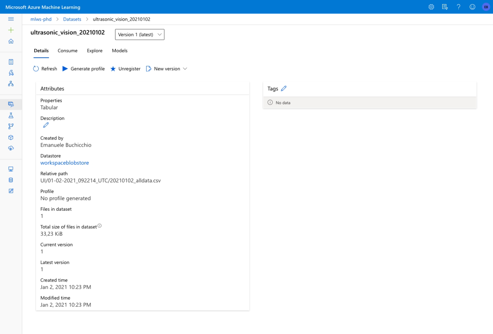
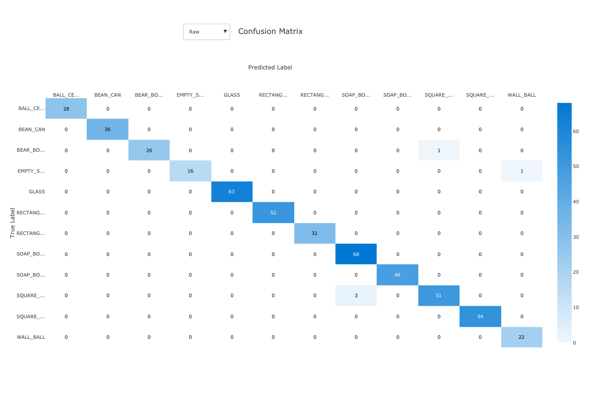
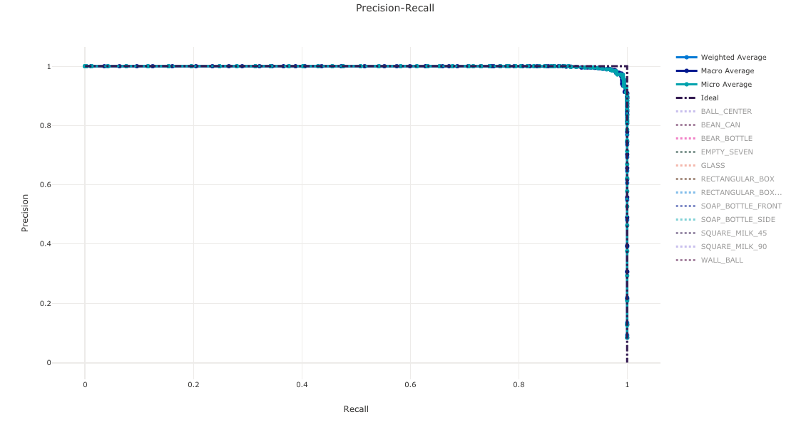
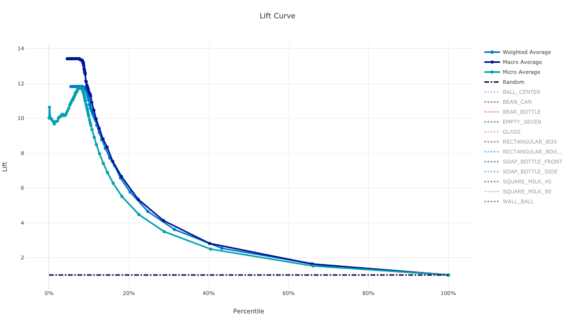
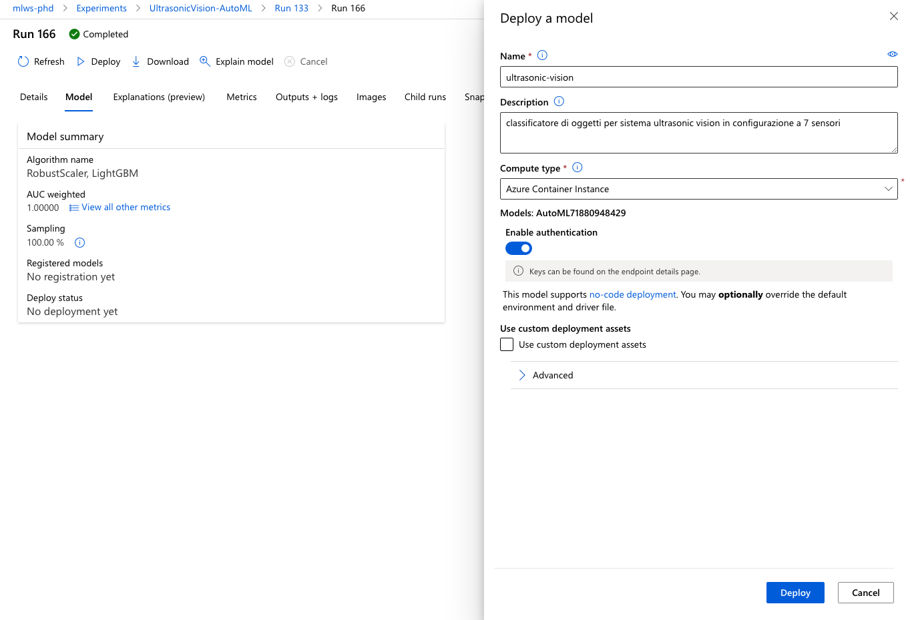

# Activity Log

## 2020-12-21

project kickoff

## 2020-12-22

creato repository di progetto

studio di fattibilità

roadmap di progetto

ipotesi architettura HW e SW

## 2020-12-25

Creato progetto e repository separato per modello riconoscimento oggetti avanzato


## 2020-12-26

### Basic Raspberry setup

keybord, power supply, nework cable

Raspian upgrade

- check raspian version [How to check the Raspbian Version - Pi My Life Up](https://pimylifeup.com/raspbian-version/)
- Raspian version history [Raspberry Pi OS - Wikipedia](https://en.wikipedia.org/wiki/Raspberry_Pi_OS)
- Raspian upgrade  [Updating and upgrading Raspberry Pi OS - Raspberry Pi Documentation](https://www.raspberrypi.org/documentation/raspbian/updating.md)
- Reboot

### Ultrasonic sensors test

Hardware:

- Raspberry PI 3 model B [Buy a Raspberry Pi 3 Model B – Raspberry Pi](https://www.raspberrypi.org/products/raspberry-pi-3-model-b/)
  - getting started [Setting up your Raspberry Pi - Introduction | Raspberry Pi Projects](https://projects.raspberrypi.org/en/projects/raspberry-pi-setting-up) 

- HC-SR04+

test code and wiring from [HC-SR04 Ultrasonic Sensor With Raspberry Pi : 6 Steps - Instructables](https://www.instructables.com/HC-SR04-Ultrasonic-Sensor-With-Raspberry-Pi-2/) 

- HC-SR04+ funzionano a 3.3V  e non a 5V! Non serve il partitore di tensione. => CONNESSIONE DIRETTA
- Spegnere Raspberry e stacare  alimentazione quando di modifica il circuito elettrico
- check model specific pinout [GPIO - Raspberry Pi Documentation](https://www.raspberrypi.org/documentation/usage/gpio/)

clonato repository su rasberry 

fix syntax for python 3

config git user info on raspberry

run  [ultrasonic-sensor-test.py](src\ultrasonic-sensor-test.py) 

test OK funziona. (foto scattate da cellulare)

Test salvataggio dati acquisiti su file per future elaborazioni


test lettura distanza e salvataggio dati in file CSV [save-sensor-data-to-file.py](src/save-sensor-data-to-file.py)

testOK

definito schema file dati
- dati per riga con ID sensore in modo da poter aggiungere sensori a piacere senza dover modificare lo schema
- valore in colonna "generica"*value" in modo da poter supportare anche alri tipi di dato

refactoring del codice:

- funzioni principali estratte dal main
- predisposizione per:
  - modalità sensore simulato
  - gestione array di sensori
- Mockup GPIO per sviluppo su windows
- Inserita modalità FAKE_HW per eseguire software senza hardware (distanza random)

## 2020-12-27 

Gestione sensori multipli 

Test acquisizione dati con sensori multipli 

- test OK. Foto setup scattata da smartphone
- aggiunto a repository esempio di acquisizione  con due sensori

Attivato Azure for students  con account  emanuele.buchicchio@studenti.unipg.it 

Attivato Workspace Azure Machine Learning 


## 2020-12-28

GPIO.cleanup() see [RPi.GPIO basics 3 – How to Exit GPIO programs cleanly, avoid warnings and protect your Pi – RasPi.TV](http://raspi.tv/2013/rpi-gpio-basics-3-how-to-exit-gpio-programs-cleanly-avoid-warnings-and-protect-your-pi)

### Use digital input to trigger measurement process startup

Gestione evento "button press" come trigger per avviare la misura

-  la gestione può essere fatta in stile "eventi e callback" (interrupt service routine nel mondo dei micrcontrollori) oppure andando in pooling all'interno di un main loop 
- 
- Nota:  nel caso di Raspberry l'SDK in python non espone gli interrupt HW del micro, quindi lo faccio nel main loop
  - esiste una gestione software delle callbak  simile agli interrupt https://roboticsbackend.com/raspberry-pi-gpio-interrupts-tutorial/ per fare "edge detection sugli input digitali"
    - https://sourceforge.net/p/raspberry-gpio-python/wiki/Inputs/
    - https://raspberrypihq.com/use-a-push-button-with-raspberry-pi-gpio/

Raspberry PI dispone di resistenze Pull-Up / Pull-Down onboard configurabili via software

- si possono usare le resistenze interne e semplificare il circuito eliminando resistenze esterne
- https://kalitut.com/raspberrypi-gpio-pull-up-pull-down-resistor/ 
- https://raspi.tv/2013/rpi-gpio-basics-6-using-inputs-and-outputs-together-with-rpi-gpio-pull-ups-and-pull-downs
- https://www.programcreek.com/python/example/98874/RPi.GPIO.add_event_detect

### Open a remote session to Raspberry

Raspberry collegato a rete WiFi. Host name "raspberrypi"

- ora è possibile eseguire sessioni remote con sistema di acquisizione montato

- per aprire una sessione remota è necessario conoscere hostaname oppure indirizzo IP del raspberry

  - il raspberry è configurato per connetersi alle reti wifi ed ottenre l'indiirzzo IP tramite DHCP quindi è meglio utilizzare l'hostname

  - da Raspian:

    `hostname` per avere il nome host

    `hostname -I` per avere l'indirizzo IP

- Da PC windows ping -a raspberrypi` per ottenere indirizzo ip

Sessione remota verso Raspberry

è  possibile utilizzare sessioni SSH oppure sessioni desktop verso il raspberry.

Nota: l'utente root di defualt di Raspian è username: pi password: raspberry

Nota2: nelle versioni recenti il server SSH su Raspian è disabilitato per defaut e deve essere abilitato  vedi [SSH (Secure Shell) - Raspberry Pi Documentation](https://www.raspberrypi.org/documentation/remote-access/ssh/) 

- server abilitato da pannello Preferenze-> configurazioni

- da windows conviene usare Putty per le sessioni SSH o Desktop remoto (RDP) per le sessioni grafiche 
  - su Raspian `sudo apt-get install xrdp`

Xrdp is an open-source implementation of Microsoft’s proprietary RDP Server, the same protocol that most installations of Windows can connect to and be connected from.

The xrdp software replicates Microsoft’s RDP protocol so that other remote desktop clients can connect to your device. The software package even works with Microsoft’s own remote desktop client built into Windows.

Nota3: in Raspian Buster (ad oggi 28-dic-2020) c'è un bug nella configurazione di XRDP che ne impedisce la corretta esecuzione dopo il rebbot. In pratica c'è un problema con i diritti di scrittura del file di log. Le soluzioni sono due: 

- modificare i permessi del file

Disable automatic start at boot time (`systemctl disable xrdp`)

```
touch /var/log/xrdp.log

chown xrdp:adm /var/log/xrdp.log

chmod 640 /var/log/xrdp.log

systemctl start xrdp

systemctl status xrdp
```

You may wish to add this to `/etc/crontab @reboot`

- modificare il percorso dle file di log nel file di configurazione /etc/xrdp/xrdp.ini

  ```
  LogFile=/tmp/xrdp.log
  ```

Nota4: c'è anche ul altro problema di configurazione di xRDP:

vedi [RDP on Raspberry Pi | I.T. Plays Well With Flavors](https://it.playswellwithflavors.com/2020/04/24/rdp-on-raspberry-pi/)

By default Xrdp uses the `/etc/ssl/private/ssl-cert-snakeoil.key` file which is readable only by users that are members of the “ssl-cert” group. You’ll need to add the user that runs the Xrdp server to the `ssl-cert` group.

```bash
sudo adduser xrdp ssl-cert 
```


Ora è possibile utilizzare l'ambiente desktop per sviluppo e debug remoto anche dopo il riavvio del Raspberry

Nota5: dalla sessione remota desktop sembra non funzionare l'arresto ed il riavvio del sistema. è necessario eseguire da terminale (o da sessione ssh) i comandi `sudo halt` e `sudo reboot`


## 2020-12-29

### configurazione a quattro sensori

wiring e firmware configuration for four sensors configuration

### Data format for machine learning training

Per rendere facimente utilizzabili i dati ho modificato lo schame del file prodotto dal sistema:

```yaml
Time:  'timestamp unix epoch time (precision to seconds)' #long

HCSR04_001: 'distanza stimata da sensore 1' #: float

HCSR04_002: 'distanza stimata da sensore 2' #: float

HCSR04_003: 'distanza stimata da sensore 3' #: float

HCSR04_004: 'distanza stimata da sensore 4' #: float

ObjectClass: 'tipo di oggetto (classe) presente'  #: string 
```

## Traning dataset 

creato dataset (con dati simulati) per iniare a sperimentare l'addestramento ed il deploy del classificatore


## Training Pipeline with AutoML

Creato Notebook per creazione Pipeline che produce e pubblica classificatore usando i dataset pubblicato in github

Work in progress.... 


## 2020-12-30

AutoML training notebook

Test pubblicazione webservice

Test creazione pipeline per retrain automatico

## 2020-12-31

Assemblato prototipo nella configurazione a 4 sensori

Test acquisizione tadi di training con vari oggetti

Arrivati oggi altri 4  sensori (da montare appena possibile)


## 2021-01-01

## Cablaggio pannello sensori superiore

I moduli HCSC04 sono predisposit per collegamento con cavi Dupont a 4 poli. In laboratorio ho disponibili solo cavi corti (10-20cm), metre per collegare i sensori sul tetto sono necessari cavi a circa 1 metro.  

Cavi lunghi sono più difficili da trovare disponibili sul mercato, ma sono costosi [Amazon.it : cavi dupont](https://www.amazon.it/s?k=cavi+dupont).  Per il prototipo ho individuato due possibili soluzioni economincamente sostenibili:

- cavo ethernet (xx coppie di cavi)
- cavo per sensori impianto di allarme a 4 poli (Vcc, GND, signal01, signal02) + schermatura + anima i nylon per restistenza meccanica

Avevo disponibili degli spezzoni da circa due metri di cavo per sistemi di allarme già tagliati  ed li ho utilizzati per realizzare i cavi dupont.


[Cavo antifurto 2 x 0,50 mm² + 2 x 0,22 mm² GR2 - MESSI & PAOLONI 5222-CCA - Spagnuolo S.R.L.](https://www.spagnuolosrl.it/prodotto/cavo-antifurto-2-x-050-mm-2-x-022-mm-gr2-messi-paoloni-5222-cca/)

 Dopo aver intestato i cavi con i connettori dupont maschio/femmina ho così ottenuto dei a quattrofili ottimi per il collegamento dei moduli HCSR04


Dopo aver realizzato i tre cavi di lunghezza sufficiente e stato possibile montare il pannello superiore con i sensori ed il relativo telaio di sostegno. Per minimizzare i disturbi il telaio di supporto è stato realizzato filo di ferro plastificato a sezione circolare.


### Test stima posizione del bersaglio con telaio supporto pannello superiore montato

Dopo aver montato il pannello superiore è stato eseguito un test del funzionamento del sistema a vuoto e con oggetti presenti nella zona di rilevazione. Nel caso non siano presenti oggetti che producono echi sonar ben definiti entro 2-3 metri di distanza i sensori HC-SR-04 producono dei risultati instabili tipici del funzionamento fuori scala.

Per evitare questo problema l'area di rilevamento è stata delimitata montando una barriera sul lato opposto a quello dei sensori. In un primo momento la barriera di delimitazione risultava essere inclinata di circa 45° rispetto al piano frontale dei sensori. In queste condizioni la distanza stimata dai sensori non era corretta. (vedi acquisizione dati "WALL")

Il pannello originale è stato poi sostituito da due pannelli separati, paralleli ai sensori (vedi acquisizione dat "WALL_45_DEGREE"). In questa configurazione tutti i sensori riescono a stimare la distanza con un errore massimo di qualche centimetro (accuratezza 5-10%) che è ragionevole ai fine dell'esperimento corrente.

I test effettuati hanno evidenziato che:

-  i sensori sono sensibili rispetto alle condizioni dell'ambiente circostante e in alcuni casi hanno restituito delle letture anomale
- La forma ed il materiale degli oggetti ha un effetto importante nell'accuratezza della stima della distanza. 
  - Per la riflessione delle onde sonore vale la legge si Snell quindi se l'onda sonora colpisce una superficie non parallela al piano frontale del sensore è possibile che l'onda riflessa non raggiunga direttamente il ricevitore (distanza stimata superiode a quella reale, o non lo raggiunga affatto)
  - L'impednza acustica dell'interfaccia tra l'aria (gas) ed un corpo solido bersaglio è solitamente molto elevata e questo in generale genera una buona riflessione. In presenza di superfici  fonoassorbenti l'energi ariflessa può essere molto minore e a volte l'eco putrebbe non essere rilevato dal ricevitore
  - 

Sistemi di acquisizione con molti sensori e legge di Murphy

	- con solo 7 sensori la legge di Murphy non vale: solo sporadicamente si sono verificati errori docuti al collegamento dei sensori .

Diversi problemi invece docuti alle breadboard di pessima qualità ... con tutti questi collegamenti meglio andare usare una millefori per ottenere un sistema ben più affidabile usando alla fine solo poco tempo in più nell'assemblaggio.


## 2021-01-02

### Configurazione a sette sensori

L'hardware utilizzato consente di utilizzare fino a 12 sensori. Al momento in laboratorio sono disponibili 5 sensori HCSR04+ e 5 sensori HCSR04 . Per l'addestramento del classificatore è stata utilizzata una configurazione con sette sensori in modo da lasciare alcuni sensori disponibili per testare l'utilizzo di moduli remoti con microcontrollore ESP8266, mantenendo invariata la configurazione dei sistema principale.

### Interfacciamento con moduli HC-SR-04 / HC-SR-04+ 

I moduli HC-SR-04 in commercio sono più o meno tutti uguali e derivano da uno stesso progetto di base. La versione "+" è stata modificata per avere tensioni di ingresso/uscita a 3.3V al posto dei 5V dell'originale.  

I moduli HC-SR-04+ possono essere collegati direttamente ai GPIO del Raspberry.

I moduli HC-SR-04 non possono essere collegati direttamente ai GPIO di Raspberry, ma serve un adattatore di livello da 5V a 3.3V. In questo caso è sufficiente un partitore di tensione.

Tra resistenze disponibili in laboratorio sono stati scelti valori 18K e 10K per realizzare il partitore.

 => v_out = 5 * 18K / (18K+10K)=3.2V 

 - 

 - 

 - image source: [Voltage divider - Partitore di tensione - Wikipedia](https://it.wikipedia.org/wiki/Partitore_di_tensione#/media/File:Voltage_divider.svg)


Nota: *Usare il rosso per Vcc 5V e Vcc 3.3 non è una buona idea*!

Test della configurazione a sette sensori (file "EMPTY_SEVEN")

- misure instabili e fuori range da parte di alcuni sensori: credo dipenda dalla geometria dell'oggetto 
  - vengono prodotte misure fuori range che probabilmente non portano informazione utile per la classificazione.
  - ragionare su come gestire i fuori range
- Dal sensore 007 non riesco ad ottenere una lettura corretta.  Ho provato a sostituire il sensore, ma il risultato non migliora.  La lettura però presenta un errore sistematico approssimativamente costante, quindi posso procedere lo stesso all'acquisizione dei dati di training.

  - problema di cablatura?
  - disturbo ambientale?
  - 

### ESD Protection

Solitamente per maneggiare i moduli destinati ai makers non servono procedure ed accortezze di protezione da scariche elettrostatiche. Questa volta però ho esagerato: durante il posizionamento dei sensori indossavo abiti sintetici e scarpe di gomma ed ho avuto modo di testare la robustrezza dai sensori a due scariche di notevole intensità. Fortuantamente funzionano ancora!  Non serve il canonico kit scarpe, camice e braccialetto per questi componenti, ma ho iniziato a toccare un termosifone prima di toccare componenti del sistema!


## Dati training 3D

Ogni oggetto è stato posto approssimativamente al centro dell'altra di acquisizione dati, senza utilizzare riferimenti precisi per la posizione con lo scopo di rendere più robusto il riconoscimento da parte del classificatore. Per ogni oggetto acquisizione dati è stata ripetuta più volte dopo aver tolto e posizionato nuovamente l'oggetto con variazioni casuali di posizionamento. 

### Posizionamento oggetti

Sono stati sperimentati diversi posizionamenti degli oggetti all'interno del range dei sensori.  I dati di training del classificatore sono stati acquisiti posizionando gli oggetti nella zona centrale on modo da avere potenzialmente letture significative da tutti sensori presenti (compresi quelli ora non presenti nella configurazione a sette sensori)


Acquisizione second dataset di training con configurazione  a sette sensori e barriere parallele ai piani dei sensori

- SQUARE_MILK_90 
- SQUARE_MILK_45 

- BEAN_CAN 
- SOAP_BOTTLE_FRONT 
- SOAP_BOTTLE_SIDE 
- GLASS 
- RECTANGULAR_BOX  
- RECTANGULAR_BOX_SIDE 
- WALL_BALL 
- BALL_CENTER 
- BEER_BOTTLE 

Ogni oggetto è stato posto approssimativamente al centro dell'altra di acquisizione dati, senza utilizzare riferimenti precisi per la posizione con lo scopo di rendere più robusto il riconoscimento da parte del classificatore. Per ogni oggetto l'acquisizione dati è stata ripetuta più volte dopo aver tolto e posizionato nuovamente l'oggetto con variazioni casuali di posizionamento. 


### Microsoft Azure for Student 

Utilizzando l'account @studenti.unipg.it è stato possibile attivare un abbonamento gratuitp "Azure for Students" con 100€ di credito e vari servizi gratuiti inclusi.


### Training dataset 20210102

Tutti i dati acquisiti con la configurazione a 7 sensori in data 2021-01-02 sono stati raccolti in un unico dataset denominato "ultrasonic_vision_20211020" registrato nel workspace Azure Machine Learning



### AutoML per classificatore

Per sviluppare e pubblicare rapidamente un classificatore da utilizzare insieme al prototipo è stato usato creato un workspace Azure Machine Learning e poi utilizzato il servizio *Automated Machine Learning*. AutoML, applica automaticamente una serie di tecniche standard di feature engeneering, parameters tuning e prova ad eseguire il training di diversi modelli utilizzando. dati forniti. Alla fine viene proposto il modello con le migliori performacne rispetto alla metrica selezionata tra quelli testati durante l'esperimento. I risultati ottenuti con i singoli esperimenti possono poi essere analizzati nel dettaglio.


### 

Nel caso specifico come metric aprimaria è stata scelta weighted AUC dato che il numeor di campioni non era omogeneo per tutte le classi. Il modello migliore tra quelli valutati è risultato essere uno di tipo "RobustScaler, LightGBM"

Modello addestrato:  [AutoML71880948429.zip](models/AutoML71880948429.zip) 

https://github.com/microsoft/LightGBM 

### Valutazione del modello

Reference: https://docs.microsoft.com/en-us/azure/machine-learning/how-to-understand-automated-ml#classification-metrics 


#### Confusion Matrix

Confusion matrices provide a visual for how a machine learning model is making systematic errors in its predictions for classification models. The word "confusion" in the name comes from a model "confusing" or mislabeling samples. A cell at row `i` and column `j` in a confusion matrix contains the number of samples in the evaluation dataset that belong to class `C_i` and were classified by the model as class `C_j`.

In the studio, a darker cell indicates a higher number of samples. Selecting **Normalized** view in the dropdown will normalize over each matrix row to show the percent of class `C_i` predicted to be class `C_j`. The benefit of the default **Raw** view is that you can see whether imbalance in the distribution of actual classes caused the model to misclassify samples from the minority class, a common issue in imbalanced datasets.

The confusion matrix of a good model will have most samples along the diagonal



#### ROC curve

The receiver operating characteristic (ROC) curve plots the relationship between true positive rate (TPR) and false positive rate (FPR) as the decision threshold changes. The ROC curve can be less informative when training models on datasets with high class imbalance, as the majority class can drown out contributions from minority classes.

The area under the curve (AUC) can be interpreted as the proportion of correctly classified samples. More precisely, the AUC is the probability that the classifier ranks a randomly chosen positive sample higher than a randomly chosen negative sample. The shape of the curve gives an intuition for relationship between TPR and FPR as a function of the classification threshold or decision boundary.

A curve that approaches the top-left corner of the chart is approaching a 100% TPR and 0% FPR, the best possible model. A random model would produce an ROC curve along the `y = x` line from the bottom-left corner to the top-right. A worse than random model would have an ROC curve that dips below the `y = x` line.


#### The precision-recall curve 

The precision-recall curve plots the relationship between precision and recall as the decision threshold changes. Recall is the ability of a model to detect all positive samples and precision is the ability of a model to avoid labeling negative samples as positive. Some business problems might require higher recall and some higher precision depending on the relative importance of avoiding false negatives vs false positives.



#### Cumulative gains curve

The cumulative gains curve plots the percent of positive samples correctly classified as a function of the percent of samples considered where we consider samples in the order of predicted probability.

To calculate gain, first sort all samples from highest to lowest probability predicted by the model. Then take `x%` of the highest confidence predictions. Divide the number of positive samples detected in that `x%` by the total number of positive samples to get the gain. Cumulative gain is the percent of positive samples we detect when considering some percent of the data that is most likely to belong to the positive class.

A perfect model will rank all positive samples above all negative samples giving a cumulative gains curve made up of two straight segments. The first is a line with slope `1 / x` from `(0, 0)` to `(x, 1)` where `x` is the fraction of samples that belong to the positive class (`1 / num_classes` if classes are balanced). The second is a horizontal line from `(x, 1)` to `(1, 1)`. In the first segment, all positive samples are classified correctly and cumulative gain goes to `100%` within the first `x%` of samples considered.

The baseline random model will have a cumulative gains curve following `y = x` where for `x%` of samples considered only about `x%` of the total positive samples were detected. A perfect model will have a micro average curve that touches the top-left corner and a macro average line that has slope `1 / num_classes` until cumulative gain is 100% and then horizontal until the data percent is 100.


#### Lift curve

The lift curve shows how many times better a model performs compared to a random model. Lift is defined as the ratio of cumulative gain to the cumulative gain of a random model.

This relative performance takes into account the fact that classification gets harder as you increase the number of classes. (A random model incorrectly predicts a higher fraction of samples from a dataset with 10 classes compared to a dataset with two classes)

The baseline lift curve is the `y = 1` line where the model performance is consistent with that of a random model. In general, the lift curve for a good model will be higher on that chart and farther from the x-axis, showing that when the model is most confident in its predictions it performs many times better than random guessing.



#### Calibration curve

Nota: questa è l'unica metrica non soddifacente dl modello analizzato. Un grafico molto lontano da quello del modello ideale che fa sospettare un problema di "overfitting"

The calibration curve plots a model's confidence in its predictions against the proportion of positive samples at each confidence level. A well-calibrated model will correctly classify 100% of the predictions to which it assigns 100% confidence, 50% of the predictions it assigns 50% confidence, 20% of the predictions it assigns a 20% confidence, and so on. A perfectly calibrated model will have a calibration curve following the `y = x` line where the model perfectly predicts the probability that samples belong to each class.

An over-confident model will over-predict probabilities close to zero and one, rarely being uncertain about the class of each sample and the calibration curve will look similar to backward "S". An under-confident model will assign a lower probability on average to the class it predicts and the associated calibration curve will look similar to an "S". The calibration curve does not depict a model's ability to classify correctly, but instead its ability to correctly assign confidence to its predictions. A bad model can still have a good calibration curve if the model correctly assigns low confidence and high uncertainty.

 Note

The calibration curve is sensitive to the number of samples, so a small validation set can produce noisy results that can be hard to interpret. This does not necessarily mean that the model is not well-calibrated.


## 2021-01-03

### Deploy web service 

Il modello ottenuto tramite AutoML è stato poi pubblicato come webservice consumabile da parte del software presente a bordo del Raspberry. Il modello sarà eseguito all'interno di un container docker ed sarà accessibile tramite chiamata POST ad un endpoint REST. 




Endpoint: http://64b32d7c-d926-4197-b807-1350e63adf7c.westeurope.azurecontainer.io/score

Nota: Per l'utlizzo dell'endpoint è necessario includere nella chiamata le chiave di autenticazione.

### Azure ML SDK Installation

[Install the Azure Machine Learning SDK for Python - Azure Machine Learning Python | Microsoft Docs](https://docs.microsoft.com/en-us/python/api/overview/azure/ml/install?view=azure-ml-py)

```shell
python -m pip install -U pip
pip install cryptography
pip install azureml-sdk
pip show azureml-core
```

Nota: la versione deve essere la stessa di quella usata nel workspace su AzureML

### Test sul campo

il modello si è dimostrato poco robusto nell'utilizzo. Sembra avere problemi di overfitting.

- alcune volte fornisce risultati instabili (la classe cambia senza che l'oggetto venga mosso a causa del rumore)
- spostamento dell'oggetto produce errori di classificazione

### Nuovo esperimento AutoML per eliminare Timestamp da schema input del webservice

[riporare risultati e scaricare modelli]

## 2021-01-04

Ipotesi di lavoro:

1. testare altri modelli con un "calibration curve" migliore ed eseguire "explain model" su quelli migliori

   1. run 182 -> 202
   2. 

2. semplificare il problema riducendo le classi ai casi più facili e ripetere addestramento

3. ripulire dati da misure errate, fuori scala, ... ecc  e poi rifare addestramento sui dati puliti.

4. trovare feature in grado di portare ad una classificazione più robusta. Trovare features che dipendano dal tipo di oggetto e non dalla sua posizione precisa es. non distanze assolute, ma differenze, somme, rapporti tra distanze. Verificare le seguenti ipotesi con plot di correlazione:

   1. somma delle distanze ad h1, somma delle distanze ad h2
   2. differenza tra le somme delle distanze ad h1 e h2
   3. differenze tra le tre altezze: (z1-z2) , (z3-z2), (z1-z3),(z2-z3)

   ## Analisi dati acquisiti
   
   Analisi dati su Colab (gratuito rispetto ad Azure che per l'esecuzione dei notebook è a pagamento)
   
   [Un benvenuto a Colaboratory - Colaboratory (google.com)](https://colab.research.google.com/)
   
    [data_visualizzation.ipynb](notebbok/data_visualizzation.ipynb) 
   
   ## 2021-01-05
   
   Creazione nuovo dataset di training
   
    [create_training_dataset.ipynb](notebbok/create_training_dataset.ipynb) 
   
   
   
   Avvio nuovo Run AutoML su dataset ripulito per generare nuvo modello da testare in ambiente di produzione
   
   - modello basato sulle 7 distanze originali e sulle altre 5 features derivate
   
   
   
   Prototipo spostato e pannelli sensori riassemblati
   
   - test robustezza modello rispetto a variazioni geometria del sistema di acquisizione
   
   
   
   Test in produzione del nuovo modello
   
   - sembra funzionare abbastanza bene anche se con alcuni errori di classificazione
   
   
   
   Notebook training classificatore SVM  con libreria Scikit learn
   
    [multiclass_SVM.ipynb](notebooks/multiclass_SVM.ipynb) 
   
   
   
   Altro Run AutoML con nuovo dataset contenente solo le nuove feature
   
   - [Esperimento UltrasonicVision-AutoML Run 282]( https://ml.azure.com/experiments/id/73dd4254-df03-403e-a9ff-899ff6aa3214/runs/AutoML_18ca3eb0-3bf6-4688-a1a3-b7fc9ea15c2b?wsid=/subscriptions/4f90113f-c88e-4cd8-9b87-9f1b78abca6a/resourceGroups/ML-PHD/providers/Microsoft.MachineLearningServices/workspaces/mlws-phd&tid=067e7d20-e70f-42c6-ae10-8b07e8c4a003)
   
   - voglio vedere se in questo modo viene fuori un modello con prestazioni decenti nell'utilizzo reale
     - deploy modello KNN (Run 293) su endpoint "ultrasonica-vision"
     - Eseguire test con dati reali del modello in produzione
   
   