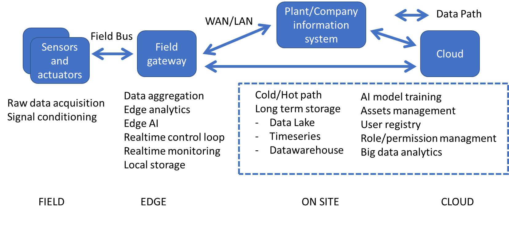
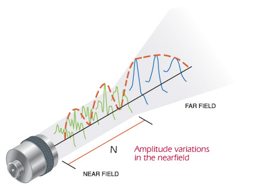
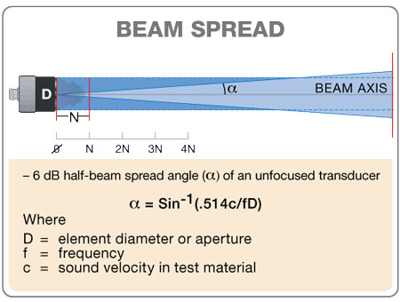
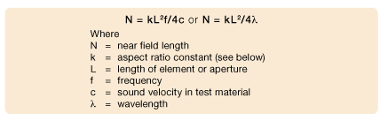

# Il sistema Ultrasonic Vision

Il sistema adotta una architettura di tipo _Edge computing_: in cui l'elaborazione è eseguita quanto più possibile vicino alla sorgente dei dati. Anche la componente di intelligenza è eseguita sul campo  per la parte di inverenza (_Edge AI_), mentre l'addestramento dei modelli è eseguito su cloud (_cloud computing_) oppure su server raggiugibili tramite rete LAN/WAN (_fog computing_) per sfruttare le maggiori risorse computazionali disponibili.

## Architettura

L'architettura di riferimento è a quattro livelli

1. sensori ed attuatori che interagiscono direttamente con il mondo fisico sul campo
2. gateway di campo (_edge_) che raccoglie i dati di tutti i sensori, esegue le elaborazioni a livello di edge computing e gestisce le comunicazioni con l'esterno
3. sistema informativo dell'impianto produttivo o dell'organizzione (MES, ERP, SCADA, databse, servizi enterprise, .... )
4. applicazione e servizi su cloud (_cloud computing_) usate principalmente per l'addestramento del modelli di machine learning e lo stoccaggio dei dati a lungo termine

## Funzionamento del sistema

La componete di campo utilizza dei misuratori di distanza ad ultrasuoni. Ogni misuratore è indipendente ed è composto da un emettitore di impulsi ad ultrasuoni e da un ricevitore. La distanza del bersaglio viene stimata misurando il tempo (_Time Of Flight - TOF_) trascorso tra l'emissione dell'impulso e la ricezione del primo eco riflesso dal bersaglio.

I misuratori sono sono fissi ed in posizioni note. L'insieme delle distanze stimate rispetto ai diversi misuratori, combinato con le informazioni sulla configurazione geometrica del sistema,  viene utilizzato per stimare la posizione del bersaglio ed riconoscere  il tipo di oggetto. L'aggregazione e la prima elaborazione dei dati provenienti dai sensori viene eseguita localmente a livello di _edge_ (_edge computing_). A questo livello viene elaborata la stima della posizione e può essere eseguita anche la classificazione del oggetto. I dati acquisiti vengono poi inviati alla componente _cloud_ per elaborazioni di secondo livello, miglioramento del modello di classificazione e memorizzazione a lungo termine (_cloud computing_).

Il riconoscimento dell'oggetto viene eseguito utilizzando un classificatore multiclasse addestrato con dati ottenuti da misurazioni precedentemente eseguite con il sistema nella stessa configurazione (numero e posizione dei sensori) su oggetti noti a priori. Il classificatore può essere eseguito localmente sul dispositivo di campo che gestisce i sensori, come web server su rete locale oppure come web server remoto.

In generale la configurazione geometrica del sistema ed il numero di sensori devono essere scelta in base ai requisiti di simmetria e risoluzione che si vogliono soddisfare. Nel caso del prototipo realizzato per questo progetto non erano stati posti  particolari vincoli e quindi sono stati utilizzati i sensori che erano disponibili in laboratorio, sperimentando diverse configurazioni geometriche.

## Propagazione degli ultrasuoni

Nel caso di oggetti con dimensioni molto maggiori della lunghezza d'onda all'interfaccia ARIA-OGGETTO le onde sonore incidenti generano on onda riflessa.  La grande differenza di impedenza acustica all'interfaccia  "ARIA - ACQUA" provoca una riflessione quasi totale, però solo l'onda riflessa che raggiunge il sensore è utile per stimare la distanza. La direzione dell'onda rilfessa dipende dall'angoli di incidenza. (vale a legge di Snell).

Il suono in aria si propaga a circa 330m/s
Nel caso dei sensori HC-SR.04 gli impulsi hanno una frequenza di 40Kz e quindi una lunghezza d'onda teorica pari a 330/40000 = 0.00825 m (8mm).

- Oggetti con dimensioni dell'ordine di gradezza di alcuni millimetri o di qualche centimetro possono possono generare fenomeni di diffrazione che possono interferire con la stima della distanza.

- oggetti con superfici "complesse" o in generale non approssimabili come superfici piane di dimensioni molto maggiori di 8mm (ad esempio con parti in rilievo, bordi, superfieci con raggio di curvatura dell'orine dei 10mm, ...) potrebero non essere compatibili con il tipo di sensore utilizzato

- oggetti con superfici curve o planari, ma non parallele al piano frontale del sensore possono riflettere l'impulso sonoro in una direzione diversa da quelle dove si trova il sensore e generare tre tipi di anomalie:
  
- eco non rilevato
- eco rilevato dopo riflessioni multiple e distanza molto maggiore di quella reale, ma nel range standard del sensore
- eco rilevato dopo riflessioni multiple e distanza molto maggiore di quella reale e fuori dal range standard del sensore

## Risoluzione spaziale del sistema di misura

In linea di principio l'onda ultrasonora generata dal trasduttore si sposta in linea retta fino a quando incontra un limite materiale. Al di fuori della zona di "campo vicino" il fronte d'onda aumenta di diametro e diverge come il fascio di un proiettore. L'angolo di diffusione del fascio di una sonda può essere calcolato nel seguente modo [1](https://www.olympus-ims.com/it/ndt-tutorials/transducers/wave-front):

Nel caso dei sensori HC-SR-004 il campo acustico lonano è quindi approssimabile con un cono con apertura di circa 15°. L'area di rilevamento del sensore ad una distanza d è quindi pari a d*sin(15):

- un cerchio di raggio 5 cm a 20 cm di distanza
- un cerchio di raggio 13 cm a 50 cm di distanza
- un cerchio di raggio 26 cm ad 100 cm di distanza

## Limitazioni note

**Il numero dei sensori utilizzabili** (e quindi la risoluzione spaziale del sistema) è limitato dal numero di linee di input/output digitale (_GPIO_)  del microcontrollore utilizzato e dal tempo disponibile per effettuare la misura (i misuratori vengono accesi singolarmente in sequenza). Solitamente i sensori ad ultrasuoni richiedono 2 linee (anche se alcuni modelli ne richiedono solo una). Nel caso del prototipo sono stati utilizzati dei sensori HC-SR04 che richiedono 2 GPIO e un Raspberry PI 3 mette a disposizione 24 GPIO quindi il prototipo, senza circuiteria aggiuntiva per multiplexing, può gestire fino a 12 sensori.

**La fisica degli ultrasuoni** impone dei limiti alla massima risoluzione spaziale che è possibile ottenere e sul tipo di oggetti e materiali  compatibili con il sistema di misura:

- il bersaglio deve avere un area equivalente parallela al piano frontale di almeno uno dei sensori dell'ordine di gradezza dei 10 cm
- superfici complesse (bordi, elementi in rilievo, ...) con dimensioni dell'ordine di grandezza di alcuni millimetri potrebbero interferire con la misura

**Il raggio d'azione** del sistema dipende dalla configurazione geometrica del sistema e dalle caratteristiche dei misuratori utilizzati. Molti misuratori commerciali a bassa costo hanno una portata operativa di 2-3 metri anche se ne esistono alcuni con portata fino 7 metri.  Ad esempio disponendo i misuratori ai vertici e lungo i lati di un quadrato di potrebbe agevolmente coprire un area di almeno 2 mq anche con misuratori di fascia economica. Un altra possibilità è quella di disporre i misuratori lungo un circonferenza di diametro minore o uguale alla portata massima dei dispositivi.

**La classificazione degli oggetti dipende sia dalla geometria dell'oggetto che dalla posizione dell'oggetto all'interno dell'area di rilevamento**.  I classificatori addestrati fino ad ora hanno performance molto elevate se gli oggetti vengono posizionati esattamente come durante la fase di training, ma non riescono ad riconoscere l'oggetto in maniera indipendente dalla posizione. Questo problema è affrontato nel progetto [Ultrasonic Object Recognition](https://github.com/emanbuc/ultrasonic-object-recognition) che ha come obiettivo la realizzazione di un sistema di riconoscimento degli oggetti basato sui misuratori ad ultrasuoni utilizzando tecniche di machine learning e deep learning avanzate.
