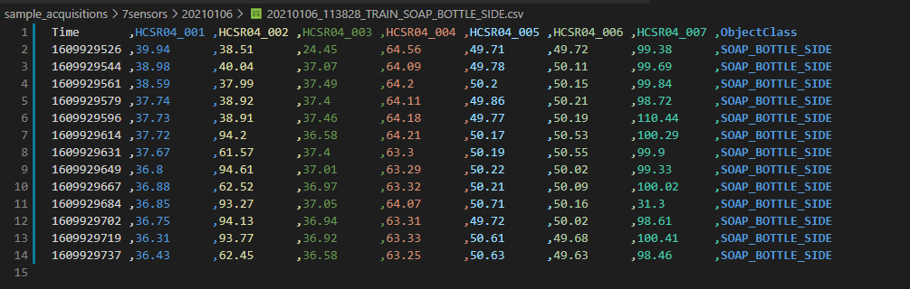
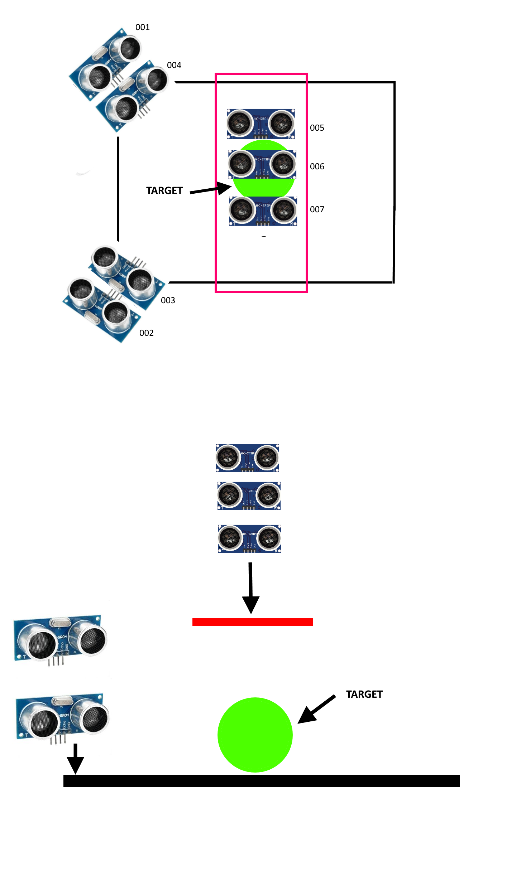
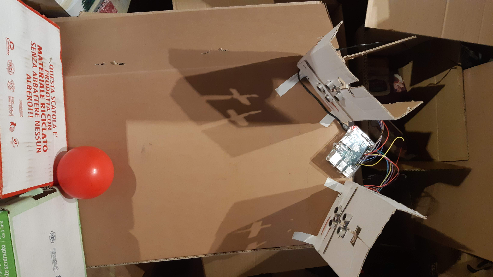
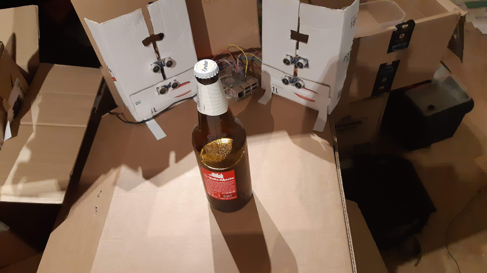

# Il prototipo Ultrasonic Vision 1.0

Lo scopo di questo protipo è quello verificare la fattibilità ed   evidenziare le criticità del sistema

## Requisiti

1. il sistema deve riuscire a rilevare la presenza di un oggetto all'interno di un area delimitata  e stimatne la posizione rispetto ai misuratori di distanza
2. il sistema deve riconoscere il tipo di oggetto presente (classificazione muticlasse)
3. il prototipo deve essere realizzato con  HW standard, a basso costo e facilmente reperibile. Possibilmente solo moduli già pronti, senza schede custom.
4. il sistema deve essere ben documentato e utilizzabile ad esempio per esercitazioni di laboratorio.  

## Hardware

Per l'assemblaggio del prototipo sono stati utilizzati:

- un Raspberry PI 3 completo di alimentatore
- misuratori di distanza ad ultrasuoni HC-SR04/HC-SR04+ (numero variabile in base alla configurazione geometrica desiderata. Il prototipo è stato testato con configurazioni a 4 e 7 sensori)
- kit di cavi Dupont per breadboard
- almeno 3 metri di cavo per sistemi di allarme a 4 fili
- tre breadbord piccole (half size)
- un pulsante
- sette resistenze 18Kohm
- sette resistenze 10Kohm

 Tutti i componenti facilmente reperibili dai rivenditori di elettronica oppure su Amazon eBay e simili. Per un elenco più esteso di possibili rivenditori vedi [Guida all'acquisto di componenti e strumenti](https://emanuelebuchicchio.wordpress.com/2016/12/10/guida-allacquisto-di-componenti-e-strumenti).

 Costo complessivo stimato per i componenti elencati inferiore a 50€ compresi breadboard e cavi.

### Misuratori di distanza ad ultrasuoni HC-SR04

Sul mercato esistono diversi misuratori di distanza ad ultrasuoni, destinati al mercato dei maker, con funzionalità e prestazioni sostanzialmente equivalenti. Per il prototipo sono stati utilizzati misuratori di distanza ad ultrasuoni tipo [HC-SR04/SR04+](https://www.alldatasheet.com/datasheet-pdf/pdf/1132203/ETC2/HC-SR04.html) che erano disponibili in laboratorio.

Le prestrazioni ed il funzionamento sono descritti [nel capitolo dedicato ai moduli HC-SR04](022_raspberry_wiring_HC-SR04.md)

### Massimo numero di sensori gestibili

Ogni sensore richiede GND, VCC + 2 GPIO (trigger + echo). Su Raspberry 2 ci sono 24 GPIO pin disponibili. Senza adottare particolari accortezze questo sistema può supportare  fino a 12 sensori.
Il timing dei sengnali sui pin "echo" e "trigger" del sensore ne permette volendo anche la gestione con un solo GPIO. In questo modo il numeor massimo di sensori che un singolo raspberry può gestire sale a 24.

### Numero di sensori utilizzati

L'hardware utilizzato consente di utilizzare fino a 12 sensori. Al momento in laboratorio sono disponibili 5 sensori HC-SR04+ e 5 sensori HC-SR04 . Per l'addestramento del classificatore è stata utilizzata una configurazione con sette sensori in modo da lasciare alcuni sensori disponibili per testare l'utilizzo di moduli remoti con microcontrollore ESP8266, mantenendo invariata la configurazione dei sistema principale.

## Software

Software sviluppato in Python: facile da scrivere, mantenere e debuggare. Attività di sviluppo e debug possono avvenire direttamente sul Raspberry (in sessione locale oppure in sessione remota) senza bisogno di altri strumenti o ambienti di sviluppo.

Per il prototipo della versione 01 sono stati sviluppati:

- Modulo FakeRPi per eseguire il software senza l'hardware di acquisizione dati
- Applicazione console ultrasonic-vision (che include la modalità di simulazione per esecuzione senza hardware)

### ultrasonic-vision.py

Il software di controllo del sistema di misura è stato sviluppato in Python 3. Lo script principale da eseguire sul sistema in produzione è l'applicazione console  [ultrasonic-vision.py](..\src\ultrasonic-vision.py)

```bash
ultrasonic-vision.py <key> <scoring-uri> [<training-label>]
```

| Parametro      | Descrizione                                                  |
| -------------- | ------------------------------------------------------------ |
| key            | API key per l'utilizzo del webservice REST che esegue il modello di classificazione. **Obbligatorio.** |
| scoring-uri    | URI dell'endpoint pubblico del webservice REST del classificatore. **Obbligatorio**.|
| training-label | Label associata alle distanze stimate dai sensori. Se questo parametro è presente l'applicazione funziona in modalità _addestramento_. **Opzionale**. |

L'applicazione può essere usata in tre modalità:

1. **modalità addestramento** in cui viene passato come parametro la "label" associata all'oggetto presente all'interno dell'area di rilevamento

   ```bash
   ultrasonic-vision.py asc12345567789 http://<...>/score BALL
   ```

2. **modalità riconoscimento** (produzione) in cui è il modello di classificazione ad assegnare la label in base alle distanze stimate dai sensori

   ```bash
   ultrasonic-vision.py asc12345567789 http://<...>/score
   ```

3. **modalità riconoscimento con hardware simulato**  in cui è il modello di classificazione ad assegnare la label in base, ma le stime delle distanze sono generate in maniera randomica.

```bash
ultrasonic-vision.py asc12345567789 http://<...>/123-456-5567/score
```

Questa modalità consente di eseguire l'applicazione su PC che non dispongono di periferiche di I/O digitale compatibili con la libreria GPIO presente nell'ambiente di runtime Python su Raspberry. Gli errori a runtime legati al modulo RPi.GPIO vengono evitati sostituendo il modulo originale con un smeplice mockup creato per questo scopo denominato FakeRPi.GPIO

Per attivare la modalità simulazione decommentare l'import del modulo FakeRPi.GPIO

```python
# import FakeRPi.GPIO as GPIO # real hardware sensors
```

e commentare quello della libreria reale

```python
import RPi.GPIO as GPIO #emulated sensors
```

### Modalità riconoscimento

Nella modalità riconoscimento l'applicazione svolge i seguenti compiti:

1. crea un file su disco locale per il salvataggio dei dati
2. entra in un loop infinito in cui se le l'interruttore di avvio  è chiuso esegue una misura
   1. inizializza i sensori
   2. acquisisce le stime della distanza del bersaglio restituita dai diversi sensori
   3. Stampa sulla console le distanze stimate dai sensori
   4. esegue la chiamata al web service del servizio  di classificazione degli oggetti in cloud e stampa sulla console il risultato
   5. esegue localmente il classificatore utilizzando le API Python del Runtime ONNX e stampa sulla console il risultato
   6. scrive le distanze e il risultato della classificazione sul file della sessione di acquisizione dati

### Modalità Addestramento

Nella modalità addestramento l'applicazione svolge i seguenti compiti:

1. crea un file su disco locale per il salvataggio dei dati
2. entra in un loop infinito in cui se le l'interruttore di avvio  è chiuso esegue una misura
   1. inizializza i sensori
   2. acquisisce le stime della distanza del bersaglio restituita dai diversi sensori
   3. Stampa sulla console le distanze stimate dai sensori
   4. scrive le distanze e la label passata come parametro sul file della sessione di acquisizione dati

### Gestione avvio della misurazione

```Py
MAIN_TRIGGER_GPIO = 26

   while True:
        if(FAKE_HW):
            mainTriggerState= True       
        else:
            mainTriggerState= GPIO.input(MAIN_TRIGGER_GPIO)
```

[Gestione evento "pulsante premuto" su Raspberry](docs/raspberry_button_pressed.md)

### Dati Prodotti da sistema di misura

L'applicazione  [ultrasonic-vision.py](..\src\ultrasonic-vision.py)  produce file in formato CSV. Ogni riga corrisponde ad una misura e contiene le seguenti informazioni:

- timestamp (in formato unix epoch) del inizio delle misura (tipo numerico intero)
- una colonna per ogni sensore presente contenente la distanza stimata in cm arrotondata alla seconda cifra decimale
- la label di classificazione associata alla misura



## Configurazione a sette sensori

Durante la realizzazione del prototipo sono state ipotizzate e testate diverse configurazioni geometriche.   L'acquisizione dei dati utilizzati per l'addestramento del classificatore è stata eseguita nella configurazione a sette sensori con quattro sensori montati su due pannelli verticali orientati verso il centro dell'area di rilevamento e tre sensori montati sul pannello orizzontale posizionato al di sopra l'area di rilevamento.

La portata utile dei sensori utilizzati è di circa 3 metri. Per ragioni logistiche la configurazione usata per l'addestramento ed il test è stata assemblata su una base di 40 x 70 cm in modo da rendere il  sistema facilmente  trasportabile.




[Test della configurazione a sette sensori](023_seven_sensors_configuration_test.md)

## Assemblaggio e cablatura

Il prototipo oltre al Raspberry utilizza solo un pulsante e sette moduli HC-SR04. Non sono necessari altri componenti esterni.

Per i dettagli sul collegamento dei moduli HC-SR04 al Raspberry vedi [cablatura SR-HC04](022_raspberry_wiring_HC-SR04.md)

## Riconoscimento degli oggetti

 Nella versione 1.0 del sistema sono stati sviluppati due diversi sistemi di classificazione, utilizzando due diversi approcci.

### Classificatore Locale  (Edge Computing)

 In questo caso Rasperry Pi  utilizzato per il prototipo dispone di un processore con architettura ARM32v7 per i quale sono disponibili i runtime delle principali librerie di machine larning e deep learning. Per il prototipo è stato selezionato [ONNX]([ONNX | Home](https://onnx.ai/)) che garantisce elevate prestazioni, interoperabilità con i principali framework di sviluppo e portabilità verso architetture diverse.

### Classificatore Remoto (Cloud Computing)

Un secondo sistema di classificazione degli oggetti è stato pubblicato utilizzando  il servizio [Azure Machine Learning](https://azure.microsoft.com/it-it/services/machine-learning/) su un _container Docker_ e reso accessibile tramite un web service REST con endpoint protetto da token di autenticazione.

## Posizionamento degli oggetti e dataset di training

## Dati training 3D

Ogni oggetto è stato posto approssimativamente al centro dell'altra di acquisizione dati, senza utilizzare riferimenti precisi per la posizione con lo scopo di rendere più robusto il riconoscimento da parte del classificatore. Per ogni oggetto acquisizione dati è stata ripetuta più volte dopo aver tolto e posizionato nuovamente l'oggetto con variazioni casuali di posizionamento.

### Posizionamento oggetti

Sono stati sperimentati diversi posizionamenti degli oggetti all'interno del range dei sensori.  I dati di training del classificatore sono stati acquisiti posizionando gli oggetti nella zona centrale on modo da avere potenzialmente letture significative da tutti sensori presenti (compresi quelli ora non presenti nella configurazione a sette sensori)


Acquisizione second dataset di training con configurazione  a sette sensori e barriere parallele ai piani dei sensori

- SQUARE_MILK_90
   
- SQUARE_MILK_45
   

- BEAN_CAN
   
- SOAP_BOTTLE_FRONT
  
- SOAP_BOTTLE_SIDE
   
- GLASS
  
- RECTANGULAR_BOX  
  
- RECTANGULAR_BOX_SIDE
   
- WALL_BALL 
- BALL_CENTER
   
- BEER_BOTTLE
   

Ogni oggetto è stato posto approssimativamente al centro dell'altra di acquisizione dati, senza utilizzare riferimenti precisi per la posizione con lo scopo di rendere più robusto il riconoscimento da parte del classificatore. Per ogni oggetto l'acquisizione dati è stata ripetuta più volte dopo aver tolto e posizionato nuovamente l'oggetto con variazioni casuali di posizionamento.
