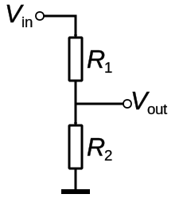
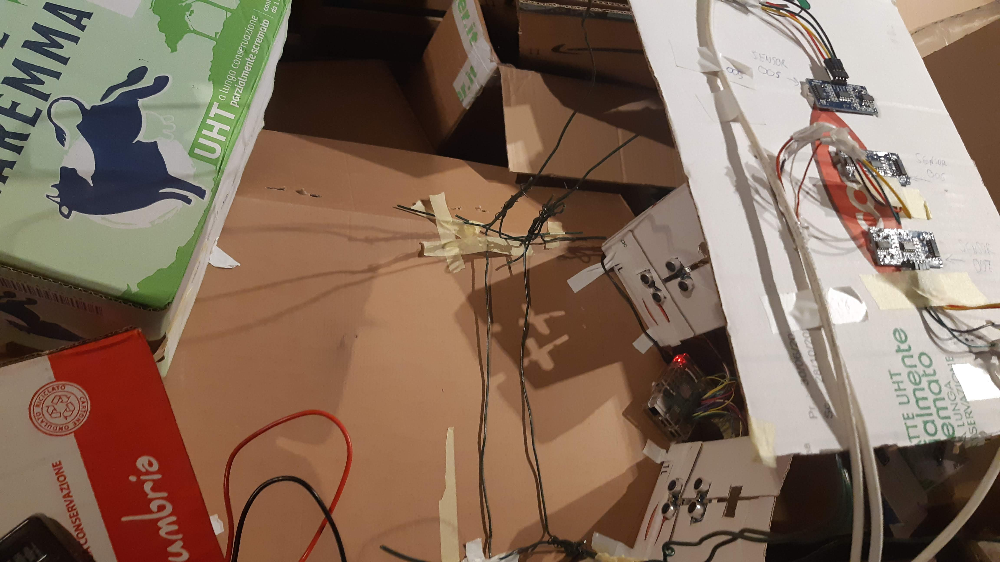

# Interfacciamento moduli HC-SR-04 / HC-SR-04+ 

I moduli HC-SR-04 in commercio sono più o meno tutti uguali e derivano da uno stesso progetto di base. La versione "+" è stata modificata per avere tensioni di ingresso/uscita a 3.3V al posto dei 5V dell'originale.  

I moduli HC-SR-04 che funzionano a 5V non possono essere collegati direttamente ai GPIO di Raspberry, ma serve un adattatore di livello da 5V a 3.3V. Nel caso specifico è sufficiente un partitore di tensione. 

 - 

 - 

 image source: [Voltage divider - Partitore di tensione - Wikipedia](https://it.wikipedia.org/wiki/Partitore_di_tensione#/media/File:Voltage_divider.svg)

 Tra resistenze disponibili in laboratorio sono stati scelti valori 18K e 10K per realizzare il partitore in modo da ottenere una tensione invefiore a 3.3V sul pin.

 => V_{out} = 5 * 18K / (18K+10K)=3.2V 

_Nota: Nel caso di configurazioni misti di moduli 3.3V a 5v attenzione alla cablatura delle linee Vcc!_

## Cablaggio pannello sensori superiore

I moduli HCSC04 sono predisposti per collegamento con cavi Dupont a 4 poli. In laboratorio ho disponibili solo cavi corti (10-20cm), mentre per collegare tutti sensori sul tetto sono necessari cavi lunghi 1-2 metri.  

Cavi dupont lunghi sono disponibili sul mercato, ma sono costosi [Amazon.it : cavi dupont](https://www.amazon.it/s?k=cavi+dupont) e non sempre facili da trovare.  Per il prototipo ho individuato due possibili soluzioni economincamente sostenibili:

- cavo ethernet (8 fili)
- cavo per sensori impianto di allarme a 4 fili (Vcc, GND, signal01, signal02) + schermatura + anima i nylon per restistenza meccanica

Avevo disponibili in laboratorio  degli spezzoni da circa due metri di cavo per sistemi di allarme ed ho utilizzato quelli per realizzare i cavi dupont.

Dopo aver realizzato i tre cavi di lunghezza sufficiente e stato possibile montare il pannello superiore con i sensori ed il relativo telaio di sostegno. 

