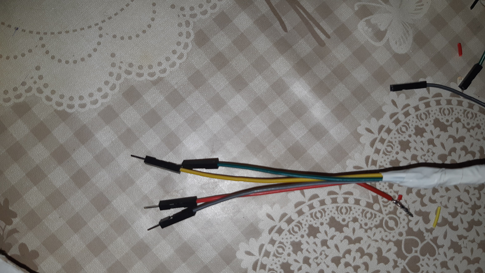

# Interfacciamento moduli HC-SR-04 / HC-SR-04+ 

I moduli HC-SR-04 in commercio sono più o meno tutti uguali e derivano da uno stesso progetto di base. La versione "+" è stata modificata per avere tensioni di ingresso/uscita a 3.3V al posto dei 5V dell'originale.  

I moduli HC-SR-04 che funzionano a 5V non possono essere collegati direttamente ai GPIO di Raspberry, ma serve un adattatore di livello da 5V a 3.3V. Nel caso specifico è sufficiente un partitore di tensione. 

 - 

 - 

 image source: [Voltage divider - Partitore di tensione - Wikipedia](https://it.wikipedia.org/wiki/Partitore_di_tensione#/media/File:Voltage_divider.svg)

 Tra resistenze disponibili in laboratorio sono stati scelti valori 18K e 10K per realizzare il partitore in modo da ottenere una tensione invefiore a 3.3V sul pin.

 => V_{out} = 5 * 18K / (18K+10K)=3.2V 

_Nota: Nel caso di configurazioni misti di moduli 3.3V a 5v attenzione alla cablatura delle linee Vcc!_

## Cablaggio pannello sensori superiore

I moduli HCSC04 sono predisposit per collegamento con cavi Dupont a 4 poli. In laboratorio ho disponibili solo cavi corti (10-20cm), metre per collegare i sensori sul tetto sono necessari cavi a circa 1 metro.  

Cavi lunghi sono più difficili da trovare disponibili sul mercato, ma sono costosi [Amazon.it : cavi dupont](https://www.amazon.it/s?k=cavi+dupont).  Per il prototipo ho individuato due possibili soluzioni economincamente sostenibili:

- cavo ethernet (xx coppie di cavi)
- cavo per sensori impianto di allarme a 4 poli (Vcc, GND, signal01, signal02) + schermatura + anima i nylon per restistenza meccanica

Avevo disponibili degli spezzoni da circa due metri di cavo per sistemi di allarme già tagliati  ed li ho utilizzati per realizzare i cavi dupont.

[Cavo antifurto 2 x 0,50 mm² + 2 x 0,22 mm² GR2 - MESSI & PAOLONI 5222-CCA - Spagnuolo S.R.L.](https://www.spagnuolosrl.it/prodotto/cavo-antifurto-2-x-050-mm-2-x-022-mm-gr2-messi-paoloni-5222-cca/)

 Dopo aver intestato i cavi con i connettori dupont maschio/femmina ho così ottenuto dei a quattrofili ottimi per il collegamento dei moduli HCSR04

Dopo aver realizzato i tre cavi di lunghezza sufficiente e stato possibile montare il pannello superiore con i sensori ed il relativo telaio di sostegno. Per minimizzare i disturbi il telaio di supporto è stato realizzato filo di ferro plastificato a sezione circolare.

