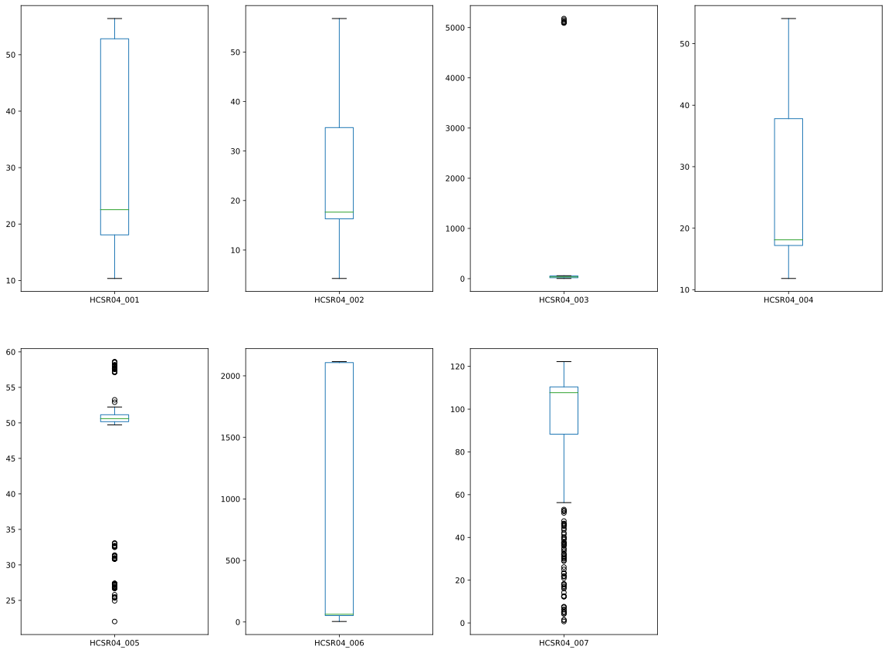
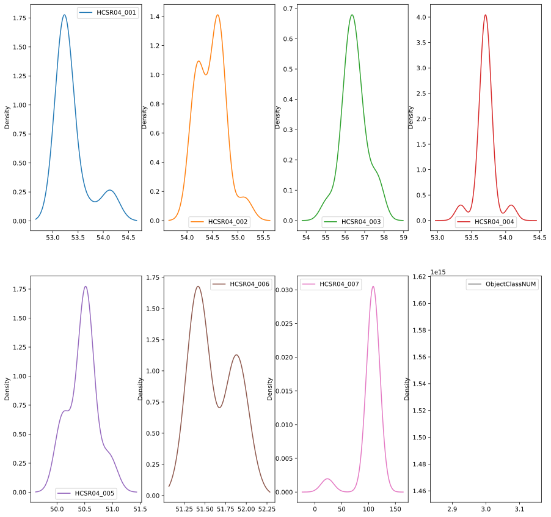
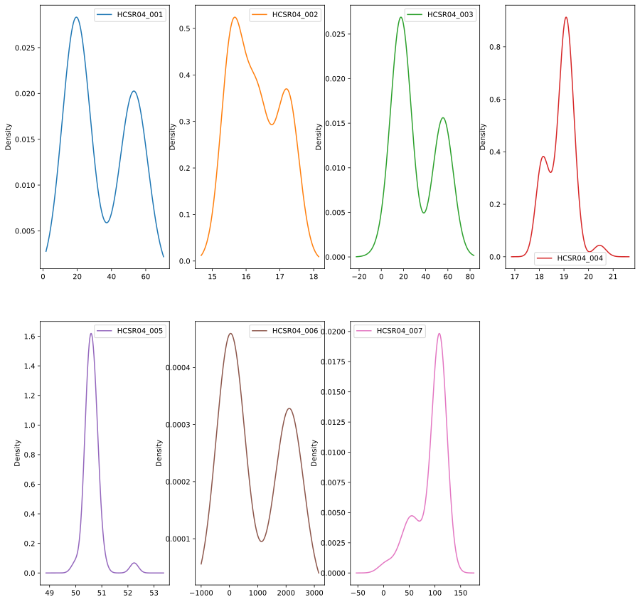
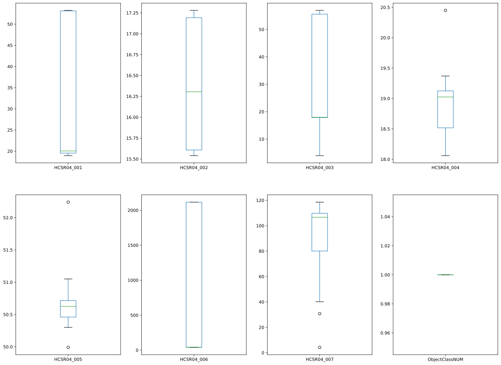

# Test del prototipo nella configurazione a sette sensori

Per testare il sistema sono stati eseguti una serie di esperimenti. I cui dati sono stati etichettati in base al tipo di oggetto presente nell'area di misura. I dati prodotti sono poi stati utilizzati per l'addestramento dle modello di classificazione. Ogni esperiemnto è stato ripetutopiù volte dopo aver rimosso e riposizionato l'oggetto all'interno dell'area di rilevamento.

Nel caso di funzionamento a vuoto, senza oggetti presenti si sono state osservati diversi episodi di funzionamento instabile dei moduli HC-SR04 riconducibili alla ricezione di echi da parte di superfi riflettenti dell'ambiente circostante.

Per evitare questo problema l'area di rilevamento è stata delimitata montando una barriera sul lato opposto a quello dei sensori.

In un primo momento la barriera di delimitazione risultava essere inclinata di circa 45° rispetto al piano frontale dei sensori. In queste condizioni la distanza stimata dai sensori non era corretta. (vedi acquisizione dati "WALL")

Il pannello originale è stato poi sostituito da due pannelli separati, paralleli ai sensori (vedi acquisizione dat "WALL_45_DEGREE"). In questa configurazione tutti i sensori riescono a stimare la distanza con un errore massimo di qualche centimetro (accuratezza 5-10%) che è ragionevole ai fine dell'esperimento corrente.

## Analisi risultati del test

vedi anche [Notebook Analisi Dati Sensori](../notebooks/analisi_dati_sensori.ipynb)

Una prima analisi dei dati raccolti durante i test del sistema nella configurazione a sette sensori mostra la presenza di molti outliers

## Analisi dati  acquisiti senza oggetto presente

Per tentare di nindividuare le cause dei numerosi dati anomali sono stati esaminati i dati provenienti dall'esperimento "EMPTY_SEVEN".

In questo esperimento nell'area di misura non era presente nessun oggetto, ma solo i pannelli di delimitazione paralleli al piano frontale dei sensori 001, 002, 003, 004 ad un distanza di circa 55 cm. Il pannello superiore che ospita i sensori 005, 006 e 007 è montato ad una altezza di circa 50 cm rispetto al piano al pavimento dell'area di misurazione.

Gli errori di stima presenti in questo esperimento sono dovuti sclusivamente al sistema di misura.

Il sensore HC-SR-04_007 è affetto da un errore sistematico che sposta il picco della distribuzione da 50 a 100 cm circa. La causa del problema non è stata individuata, ma l'analisi dei dati degli altri esperimenti dimostra che la misura del tempo di volo fornita dal sensore è comunque fortemente correlata alla distanza del bersaglio dal sensore. La distanza stimata da HC-SR-04_007 contiene quindi informazione utile e i dati prodotti dal sensore non sono stati scartati.

Tutti gli altri sensori forniscono un stima della distanza compatibile con la precisione dichiarate nel datascheet dell'ordine del camtimetro.

Gli outliears presenti negli altri esperiemnti sono quinid da attribuire ad interferenze ambientali, alla particolare geometria dell'oggetto bersaglio, al materiale e al tipo di superfice riflettente.

### Test modello AWGN (Additive White Gaussin Noise)

Lipotesi la stima del tempo di volo fornita dai sensori sia modellabile come come una variabile aleatori di dipo AWGN intorno al valore della distanza del bersaglio non risulta supporta dai dati sperimentali. Il test di normalità viene superato da alcuni sensori in alcuni esperiemnti, ma l'ipotesi non è verificata in generale per tutte le popolazioni di campioni.

 Una possibile spigazione potrebbe essere cercata nella presenza dei numerosi outlier che in alcuni casi danno origine a delle distibuzioni multivariate. Questo risultato merita un approfondimento ed una verifica sperimentale più accurata.

Il test di normalità applicato è quello implementato nella funzione [normaltest](https://docs.scipy.org/doc/scipy/reference/generated/scipy.stats.normaltest.html) della libreria SciPy

    This function tests the null hypothesis that a sample comes from a normal distribution. It is based on D’Agostino and Pearson’s 1, 2 test that combines skew and kurtosis to produce an omnibus test of normality.

    References

    1 D’Agostino, R. B. (1971), “An omnibus test of normality for moderate and large sample size”, Biometrika, 58, 341-348

    2 D’Agostino, R. and Pearson, E. S. (1973), “Tests for departure from normality”, Biometrika, 60, 613-622

## Analisi dati esperimenti con oggetti

Il dataset include i dati raccolti posizionando diversi tipi oggetti all'interno dell'area di misura approssimativamente nella stessa posizione. Gli esperimenti sono stai ripetuti più volte riposizionando ogni volta l'oggetto. Ad ogni ripetizione l'oggetto è stato posizionato in una posizione leggermente diversa da quella precedente, in modo da produrre un dataset di addestramento più simile alle condizioni operative del sistema in produzione.

A titolo di esempio viene riportata l'analisi dell'esperimento "BEAN_CAN" eseguito su un barattolo di fagioli in scatola con dimensioni vicine al limite inferiore ammissibile e una geometria idonea ad evidenzare eventuali problemi nella stima delle distanze (superficie cilindrica, presenza di superfici complesse (elementi tridimensionali e bordi)

L'esperimento è stato ripetuto tre volte rimuovendo e riposizionando l'oggetto. Per ogni posizionamento sono state ottenute rispettivamente 10,11 e 15 misure valide contenenti la stima della distanza da tutti i sensori. (in totale 36 misure)I risultati delle tre ripetizioni sono stati riportati nei file:

- 20210102_114551_TRAIN_BEAN_CAN.csv
- 20210102_153734_TRAIN_BEAN_CAN.csv
- 20210102_165012_TRAIN_BEAN_CAN.csv
  
I grafici delle distribuzioni mostrano due picchi ben distinti, mentre il terzo gruppo di dati non è evidente dai grafici perchè le stime delle distanze ottenute nella seconda e nella terza ripetizione sono piuttosto simili.

### Stime delle distanze orizzontali

Nella prima ripetizione il sensori HCSR04_001 e HCSR04_003 hanno fornito delle stime molti vicine al caso "oggetto non presente" (EMPTY_SEVEN). Nelle altre ripetizioni ha dato delle stime vicine alla distanza reale di circa 20 cm
Nella prima ripetizione il sensori HCSR04_001 e HCSR04_003 hanno prodotto delle stime sostanzialmente corrette in tutte le ripetizioni

### Stime delle distanze verticali

Il sensore 005 non "ha visto" l'oggetto in nessuna delle ripetizioni
il sensore 006 ha fornito un stima completamente errata (2000 cm) nel primo esperimento e sotanzialmente corretta (circa 40 cm) nelle altre due ripetizioni

I dati del sensore 007 presentano una distribuzione diversa dal caso "empty seven", ma non è chiaro come questa differenza sia correlata alla presenza dell'oggetto nell'area di misura.

## Conclusioni

I test effettuati hanno evidenziato che:

- La stima della distanza restituita dai moduli HC-SR04 è influenzata da fari fattori ambientali (variazioni di temperatura, correnti d'aria, sorgenti di rumore o vibrazione significative ...)
- La forma ed il materiale degli oggetti ha un effetto importante nell'accuratezza della stima della distanza.
  - Per la riflessione delle onde sonore vale la legge si Snell quindi se l'onda sonora colpisce una superficie non parallela al piano frontale del sensore è possibile che l'onda riflessa non raggiunga direttamente il ricevitore (distanza stimata superiode a quella reale, o non lo raggiunga affatto)
  - L'impednza acustica dell'interfaccia tra l'aria (gas) ed un corpo solido bersaglio è solitamente molto elevata e questo in generale genera una buona riflessione. In presenza di superfici  fonoassorbenti e l'energi ariflessa può essere molto minore e a volte l'eco putrebbe non essere rilevato dal ricevitore
  - Nel caso di superci irregolari l'onda riflessa può essere molto attenuta a causa fi fenomeni di diffrazione

Per un analisi dettagliata dei dati acquisiti durante i test vedi [Notebook Analisi Dati Sensori](../notebooks/analisi_dati_sensori.ipynb)
