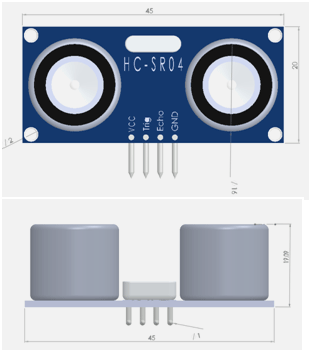

# Misuratori di distanza ad ultrasuoni HC-SR04

Sul mercato esistono diversi misuratori di distanza ad ultrasuoni, destinati al mercato dei maker, con funzionalità e prestazioni sostanzialmente equivalenti. Per il prototipo sono stati utilizzati misuratori di distanza ad ultrasuoni tipo [HC-SR04/HC-SR04+](https://www.alldatasheet.com/datasheet-pdf/pdf/1132203/ETC2/HC-SR04.html) che erano disponibili in laboratorio.

Si tratta di moduli standard, realizzati e distribuiti da diversi fornitori, facilmente reperibili sul mercato al costo indicativo di 2-3€ l'uno.

_Nota: Dei moduli HC-SR04 [esistno divese versioni](https://emanuelebuchicchio.wordpress.com/2016/08/04/sensore-ad-ultrasuoni-hc-sr04-un-sonar-integrato-compatibile-con-esp8266-arduino-e-raspberry-per-3e/) tra cui anche alcune funzionano a 3.3-3.5 Volt, mentre l'originale funziona a 5V._

Carattristiche HC-SR04

- Operating voltage: +5V
- Theoretical Measuring Distance: 2cm to 450cm
- Practical Measuring Distance: 2cm to 80cm
- Accuracy: 3mm
- Measuring angle covered: <15°
- Operating Current: <15mA
- Operating Frequency: 40Hz

Per maggiori informazini vedi sul funzionamento di questi moduli vedi i link in [Risorse.md]

## Pinout HC-RS04

I moduli sono dotati di interfaccia standard a 4 pin utilizzata da molti sensori

| **Pin Number** | **Pin Name** | **Description**                                              |
| -------------- | ------------ | ------------------------------------------------------------ |
| 1              | Vcc          | The Vcc pin powers the sensor, typically with +5V            |
| 2              | Trigger      | Trigger pin is an Input pin. This pin has to be kept high for 10us to initialize measurement by sending US wave. |
| 3              | Echo         | Echo pin is an Output pin. This pin goes high for a period of time which will be equal to the time taken for the US wave to return back to the sensor. |
| 4              | Ground       | This pin is connected to the Ground of the system.           |