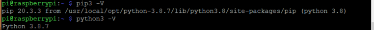

# Installazione Python3.8 su Raspian Buster (dicembre 2020)

Ambiente di sviluppo su MacOS (Anaconda) e su Windows utilizza Python 3.8. Per evitare problemi di portabilità dei modelli è preferibile utilizzare la stessa configurazione tra ambiente di sviluppo e produzione.

Inoltre in rete sono disponibili esempi e librerie richiedono Python 3.8 e non funzionano non funzionano su Python3.7. ll pacchetto python3 per Raspian è aggironato solo fino alla versione 3.7. Per installare la versione 3.8 è quindi necessario compilarla dai sorgenti.  

I sorgenti si possono scaricare da [Python Source Releases | Python.org](https://www.python.org/downloads/source/) - ultima versione stabile pubblicata ad oggi (dicembre 2020) è la 3.8.7

```Bash
wget https://www.python.org/ftp/python/3.8.7/Python-3.8.7.tgz
```

Per la compilazione è necessario installare alcune librerie che potrebbero non essere presenti sul sistema. Meglio installare i prerequisiti prima di avviare il processo. Da terminale:

```bash
sudo apt-get update
sudo apt-get install -y build-essential tk-dev libncurses5-dev libncursesw5-dev libreadline6-dev libdb5.3-dev libgdbm-dev libsqlite3-dev libssl-dev libbz2-dev libexpat1-dev liblzma-dev zlib1g-dev libffi-dev
```

## Installazione di Python 3.8

Sul web si trovano diverse guide per l'installazione.  Ad esempio: [How to install Python 3.8 on Raspberry Pi](https://www.ramoonus.nl/2019/10/23/how-to-install-python-3-8-on-raspberry-pi/). La procedura che ho utilizzato io è questa:

### 1) scaricare i sorgenti e compilare

```bash
wget https://www.python.org/ftp/python/3.8.7/Python-3.8.7.tar.xz
tar xf Python-3.8.7.tar.xz
cd Python-3.8.7
./configure --prefix=/usr/local/opt/python-3.8.7
make -j 4
```

### 2) Install

```bash
sudo make altinstall
```

### 3) Remove the files

```bash
cd ..
sudo rm -r Python-3.8.7
rm Python-3.8.7.tar.xz
```

### 4) Aprire il file .bashrc con Nano

```bash
nano ~/.bashrc
```

In fondo al file aggiungere il path e gli alias per l'installazione di Python3.8 In questo modo l'OS continua a gestire la distribuzione di Python3.7 nella /usr/bin, ma per l'utente corrente gli alias alias _pip3_ e _python3_ punteranno all'installazione della versione 3.8 in  _/usr/local/opt_

```bash
export PATH=/usr/local/opt/python-3.8.7/bin/:$PATH
alias pip3=/usr/local/opt/python-3.8.7/bin/pip3.8
alias python3=/usr/local/opt/python-3.8.7/bin/python3.8
```

### 5) rileggere il file .bashrc

```shell
source ~/.bashrc
```

### 6) Verificare gli alias

```shell
python3 -V
pip3 -V
```



## Installare pip, wheel

Nel nuovo ambiente Python3.8 è ora necessario aggiornare pip ed installare wheel per poter poi scaricare tutti i pacchetti che saranno utilizzati.

**Attenzione con il comando "sudo" gli alias non funzionano (la procedura del paragrafo precedente li ha creati solo per l'utente "pi"), quindi è necessario specificare il path completo per installare i pacchetti.**

```shell
sudo /usr/local/opt/python-3.8.7/bin/pip3.8 install --upgrade pip wheel
```

Per installare gli altri pacchetti come ad esempio numpy:

```shell
sudo /usr/local/opt/python-3.8.7/bin/pip3.8 install numpy
```

**Attenzione: i pacchetti binari precompilati PyWheel sono disponibili solo per alcune architetture e versioni di python. Spesso per Python 3.8 è necessario compilare dai sorgenti a questa operazione su Raspberry può richiedere diverse ore.**
