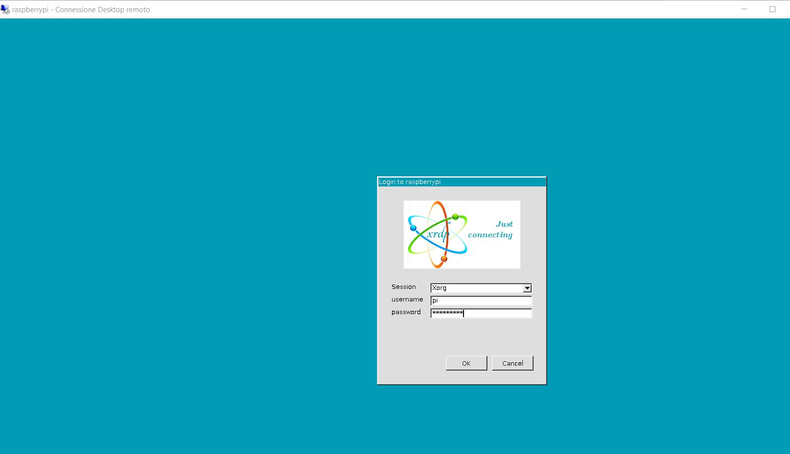
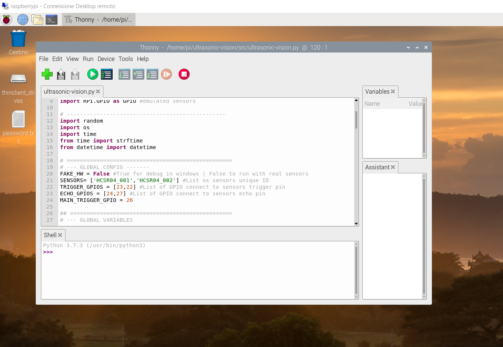

# Sessione Desktop Remoto da Windows a Raspian (Raspberry OS)

Prerequisiti:

- Raspberry collegato a rete locale (WiFi o cablata)
- Rasbberry configurato con Host name "raspberrypi"

Per aprire una sessione remota è necessario conoscere hostaname oppure indirizzo IP del raspberry

Per impostazione predefinita il raspberry è configurato per connetersi alle reti wireless o cablate ed ottenre un indirizzo IP dinamico tramite DHCP quindi è meglio utilizzare l'hostname che invece rimane costante.

hostname predfinito configugrato durante l'installazione di Raspberry OS è "raspberrypi", ma può essere cambiato.

Da terminale Raspian OS:

 `hostname` per avere il nome host

`hostname -I` per avere l'indirizzo IP

Da terminale su PC windows:
`ping -a raspberrypi` per ottenere indirizzo ip

## Installazione server RDP su RaspberryOS

Su Raspian `sudo apt-get install xrdp`

Xrdp is an open-source implementation of Microsoft’s proprietary RDP Server, the same protocol that most installations of Windows can connect to and be connected from.

The xrdp software replicates Microsoft’s RDP protocol so that other remote desktop clients can connect to your device. The software package even works with Microsoft’s own remote desktop client built into Windows.

In Raspian Buster (ad oggi 28-dic-2020) ci sono due bug nella configurazione di XRDP che ne impedisce la corretta esecuzione dopo il rebbot.

In pratica ci sono due problemi con i diritti letura e  scrittura su alcuni file utilizzati da XRDP.

### Modificare i permessi del file di log

Disable automatic start at boot time Da teminale:  (`systemctl disable xrdp`)

Modificare il percorso dle file di log nel file di configurazione `/etc/xrdp/xrdp.ini`

  ```Ini
  LogFile=/tmp/xrdp.log
  ```

C'è anche un altro problema di configurazione di xRDP:

vedi [RDP on Raspberry Pi | I.T. Plays Well With Flavors](https://it.playswellwithflavors.com/2020/04/24/rdp-on-raspberry-pi/)

By default Xrdp uses the `/etc/ssl/private/ssl-cert-snakeoil.key` file which is readable only by users that are members of the “ssl-cert” group. You’ll need to add the user that runs the Xrdp server to the `ssl-cert` group.

```bash
sudo adduser xrdp ssl-cert 
```

Ora è possibile utilizzare l'ambiente desktop per sviluppo e debug remoto anche dopo il riavvio del Raspberry





_Nota: dalla sessione remota desktop sembra non funzionare l'arresto ed il riavvio del sistema. è necessario eseguire da terminale (o da sessione ssh) i comandi `sudo halt` e `sudo reboot`_
