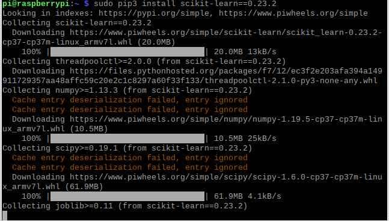
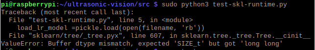
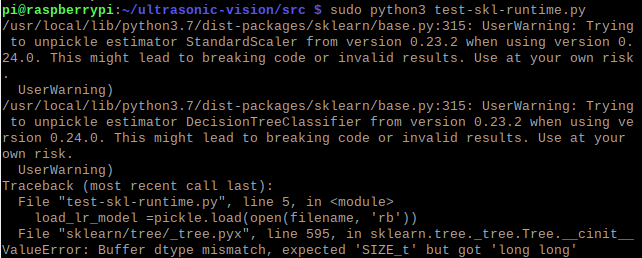
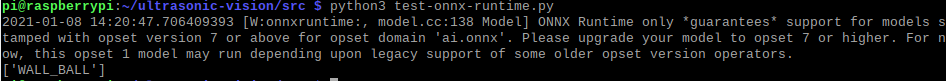

# Raspberry PI per applicazioni di Edge AI

Addestramento modelli classificazione con scikitlearn con notebook [multiclass_SVM.ipynb](notebooks\multiclass_SVM.ipynb) 

Esecuzione modello di classificazione locale su raspberry

- necessario installare scikit leanr su Raspberry

   ```shell
    pip3 install -U scikit-learn=='0.22.2.post1'
    ```

    attenzione alla versione: su colab c'è la 0.22.2.post1 

    anaconda su Mac con Anaconda c'è la 0.23.2 
    
    - serve anche un versione più recente di NumPy 

- non serve invece installare pickle perchè è già incluso nella distruzionzione correnti di python 3

- script addestramento modelli

- conversione modelli in formato ONNX ed esecuzione locale 

- problemi vari con ONNX runtime su PC, Mac e Raspberry 

  - librerie mancanti e versioni non uniformi nei vari ambiente
  - problema potabilità modelli ML
    - ONNX ? 

#### Python 3.7

I modelli sono stati addestrati nell'ambiente di sviluppo su  MacOs con SciKit-Learn 0.23.2. La versione corrente è la 0.24, ma per  caricarli è consigliabile utilizzare la stessa versione. 

```
sudo pip3 install scikit-learn==0.23.2
```

Ora finalmente pip3 installa dai pacchetti binari  da PyWheel

 


```bash
python3 test-skl-runtime.py
```

Il test ha esito negativo



Provo ad installare la versione più recente 

```bash
sudo pip3 install scikit-learn==0.24
```

Stesso errore con in più i  warning dovuti alla diversa versione tra ambiente di sviluppo e produzione




Nonostante numerosi tentativi non è stato possibile utilizzare i modelli su Raspberry. Gli stessi modelli funzionano invece correttamente su MacOs e su Windows.


## Inferenza con modelli ML su Raspberry con ONNX Runtime

Microsoft e una community di partner hanno creato ONNX come standard aperto per la rappresentazione di modelli di machine learning. I modelli di [molti Framework](https://onnx.ai/supported-tools) , tra cui TensorFlow, PyTorch, SciKit-Learn, keras, Chainer, MXNET, MATLAB e SparkML possono essere esportati o convertiti nel formato ONNX standard. Quando i modelli sono nel formato ONNX, possono essere eseguiti in un'ampia gamma di piattaforme e dispositivi.

L'ottimizzazione dei modelli di machine learning per l'inferenza o il punteggio del modello è difficile poiché è necessario ottimizzare il modello e la libreria di inferenza per sfruttare al meglio le funzionalità hardware. L'ottimizzazione di tutte le diverse combinazioni di Framework e hardware è molto dispendiosa in termini di tempo. 

[ONNX Runtime](https://onnxruntime.ai/) è un motore di inferenza a prestazioni elevate per la distribuzione di modelli ONNX in produzione. È ottimizzato per cloud e Edge e funziona in Linux, Windows e Mac. Scritto in C++, include anche API C, Python, C#, Java e JavaScript (Node.js) per l'utilizzo in diversi ambienti.  

ONNX Runtime is backward compatible with all the operators in the ONNX specification. Newer versions of ONNX Runtime support all models that worked with the prior version.

Utilizzando ONNX è possibile risolvere contemporaneamente due importanti problemi

- la portabilità del modello su piattaforme hardware diverse
- interoperabilità tra i diversi framework di ML esistenti

Nell'abito di questo progetto problemi di portabilità si sono verificati anche tra gli ambienti di sviluppo locali (Anaconda di Windows10 e MacOS) e ambienti di sviluppo cloud (Azure Machine Learning, Google Colaboratory) e successivamente anche tra gli ambienti di sviluppo locali e gli ambienti di produzione (raspberry e container docker su Azure Machiene Learning)

### Installazione ONNX Runtime

Guida [Install - onnxruntime](https://www.onnxruntime.ai/docs/get-started/install.html#linux--cpu)

#### Prerequisites

Raspian Update

```bash
sudo apt update
sudo apt upgrade
sudo reboot
```

English language package with the `en_US.UTF-8` locale

- Install [language-pack-en package](https://packages.ubuntu.com/search?keywords=language-pack-en)
- Run `sudo locale-gen en_US.UTF-8`
- Run `sudo update-locale LANG=en_US.UTF-8`

OpenMP

- `sudo apt-get install libgomp1`, which installs **libgomp.so.1**

Python3.5 - 3.8

Le versioni recenti del runtime ONNX per python richiedono Python3.8 che però non è presente su Raspian. Anche la [versione più recente della distribuzione](https://en.wikipedia.org/wiki/Raspberry_Pi_OS) (ad oggi dicembre 2020) purtroppo installa Python3.7 

#### Installazione

Per l'architettura ARM32v7 del Raspberry  non sono disponibili release binarie ufficiali ne sul sito ONNX ne su [PyWheel · PyPI ](https://pypi.org/project/PyWheel/). Per  utilzzare il runtime è quindi necessario eseguire un build ad hoc sul Raspberry stesso oppure come cross compilazione specificando il target ARM32v7.

Il processo di build è documentato è su [onnxruntime/BUILD.md at master · microsoft/onnxruntime (github.com)](https://github.com/microsoft/onnxruntime/blob/master/BUILD.md). La build è comunque un processo lungo e richiede un ambiente di sviluppo non banale da configurare. Fortunatamente è possibile reparire dei pacchetti PyWheel già compilati per Raspberry. Ad esempio su questi repository:

-  [NagarajSMurthy/RaspberryPi-ONNX-Runtime: Install ONNX Runtime on Raspberry Pi 3B+ (github.com)](https://github.com/NagarajSMurthy/RaspberryPi-ONNX-Runtime)
-  [nknytk/built-onnxruntime-for-raspberrypi-linux: Built python wheel files of https://github.com/microsoft/onnxruntime for raspberry pi linux.](https://github.com/nknytk/built-onnxruntime-for-raspberrypi-linux) 

A  questo punto si può installare il pacchetto wheel  precompilato del runtime di ONNX.(seguendo la procedura di buil oppure scaricando il pacchetto binario già compilato per ARM32v7 e python3.7/3.8 da [nknytk/built-onnxruntime-for-raspberrypi-linux: Built python wheel files of https://github.com/microsoft/onnxruntime for raspberry pi linux.](https://github.com/nknytk/built-onnxruntime-for-raspberrypi-linux))

**Python 3.7**

```bash
https://github.com/nknytk/built-onnxruntime-for-raspberrypi-linux/raw/master/wheels/buster/onnxruntime-1.6.0-cp37-cp37m-linux_armv7l.whl

sudo pip3 install onnxruntime-1.6.0-cp37-cp37m-linux_armv7l.whl
```

**Python 3.8**

```bash
https://github.com/nknytk/built-onnxruntime-for-raspberrypi-linux/raw/master/wheels/buster/onnxruntime-1.6.0-cp38-cp38-linux_armv7l.whl
```

```bash
sudo /usr/local/opt/python-3.8.7/bin/pip3.8 install onnxruntime-1.6.0-cp38-cp38-linux_armv7l.whl
```

Ora è finalmente possibile testare l'esecuzione locale del modello  eseguendo lo script di test dalla cartella /src

```bash
cd src
python3 test-onnx-runtime.py
```



