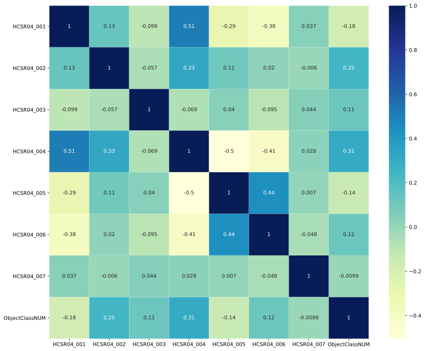

# Sviluppo di un modello di classificazione degli oggetti

Vedi anche [notebook analis dati sensori](../notebooks/analisi_dati_sensori.ipynb)

L'analisi della correlazione tra le distanze stimate dai sensori ed il tipo di oggetto presente (ObjectClass) non evidenzia l'esistenza di correlazioni lineari rilevanti tra i dati del singol sensore e la classe di appartenza dell'oggetto besaglio.

