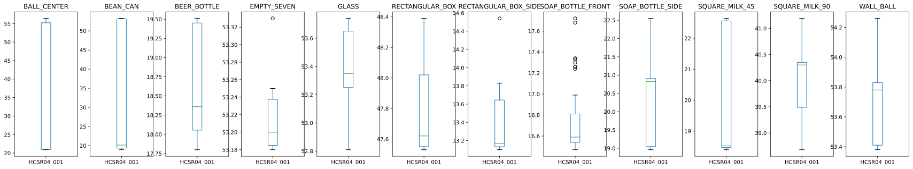
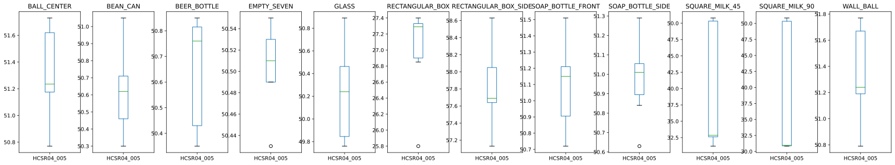

# Sviluppo di un modello di classificazione degli oggetti

Vedi anche [notebook analis dati sensori](../notebooks/analisi_dati_sensori.ipynb)

L'analisi della correlazione tra le distanze stimate dai sensori ed il tipo di oggetto presente (ObjectClass) non evidenzia l'esistenza di correlazioni lineari rilevanti tra i dati del singol sensore e la classe di appartenza dell'oggetto besaglio.


## Analsi delle singole features

I range delle features sono molto diversi a causa degli errori di stima. Per una analisi visiva della separabilità delle classi in base alle features disponibili è necessario prima rimuovere gli outliers.
Le distanze dipendono sia dalla posiizone dell'oggetto che dal tipo di oggetto

Si riporta qui a titolo di esempio il boxplot dei dati di due sensori disegnato per i diversi tipi di oggetto.




Anche dopo la rimozione degli outliears il pattern delle distanze prodotto dai diversi tipi di bersaglio dipende, oltre che dalla distanza del bersaglio, anche dalla posizione del bersaglio all'interno dell'area di misura.

La dipendenza dalla posizione rende complessa la relazione tra la distanza stimata e la classe di appartenenza del bersaglio.

Per lo sviluppo del modello di classificaizone automatica degli oggetti sono stati proati due metodi:

1. [Addestramento manuale](062_training_scikit-learn_model.md) dei modelli di classificazione con libreria SciKit Learn
2. [Addestramento automatico](070_azure_autoML.md) mediate servizio AutoML di Azure Machine Learning

I modelli ottenuti dopo essere stati validati e testati nell'ambiente di sviluppo ed in seguito pubblicati si come web service in cloud (cloud AI) che su runtime locale (EdgeAI).

### Rimozione outliears

Per la rimozione degli outliears è stato utilizzato il metodo Inter Quartile Range (IQR) con soglie Q1-1.5 e Q3+1.5

```Python
def RemoveOutlierIQR(rawData,columnNames,groupLabel):
    df_all_clean = pandas.DataFrame(columns = columnNames) 
    for name, group in rawData.groupby(['ObjectClass']):
        Q1 = group.quantile(0.25)
        Q3 = group.quantile(0.75)
        IQR = Q3 - Q1

        data_clean = group[~((group < (Q1 - 1.5 * IQR)) |(group > (Q3 + 1.5 * IQR))).any(axis=1)]
        df_all_clean = pandas.concat([df_all_clean,data_clean])
    return df_all_clean
```

## Conclusioni e futuri sviluppi

Il pattern delle distanze stimate dipende in maniera non facilmente separabile sia dal tipo di oggetto presente nell'area di rilevamento che dalla posizione dell'oggetto rispetto ai sensori. Il problema può essere mitigato (e forse risolto) scgliendo una opportuna configurazione geometrica (numeoro e posizione dei sensori).

L'impossibilità di separare gli effetti della posizione dell'bersaglio da quelli della geometria e della caratteristiche fisiche dell'bersaglio creano rendono particolarmente complesso il compito di sviluppare di classificazione degli oggetti indipendente dalla posizione utilizzando la configurazione "seven sensors".

I modelli di classificazione addestrati e testati si sono invece rivelati molto precisi se gli oggetti da identificare vengono posizionati in maniera precisa, riucreando una condizione molto vicina a quella in cui sono stati prodotti i dati di addestramento.

Si tratta di una forma di overfitting in cui il modello ha "memorizzato" i dati di training invece di generalizzare ed imparare a distinguere i tipi di oggetto.
