# Azure AutoML

Utilizzando l'account @studenti.unipg.it è stato possibile attivare un subscription "Azure for Students" con 100€ di credito e vari servizi gratuiti inclusi che ha permesso di istanziare un workspace utilizzare sulla piattaforma cloud _Azure Machine Learning_

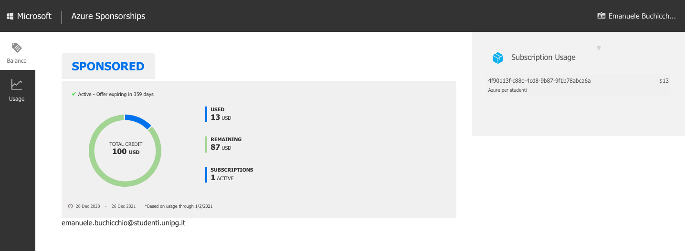

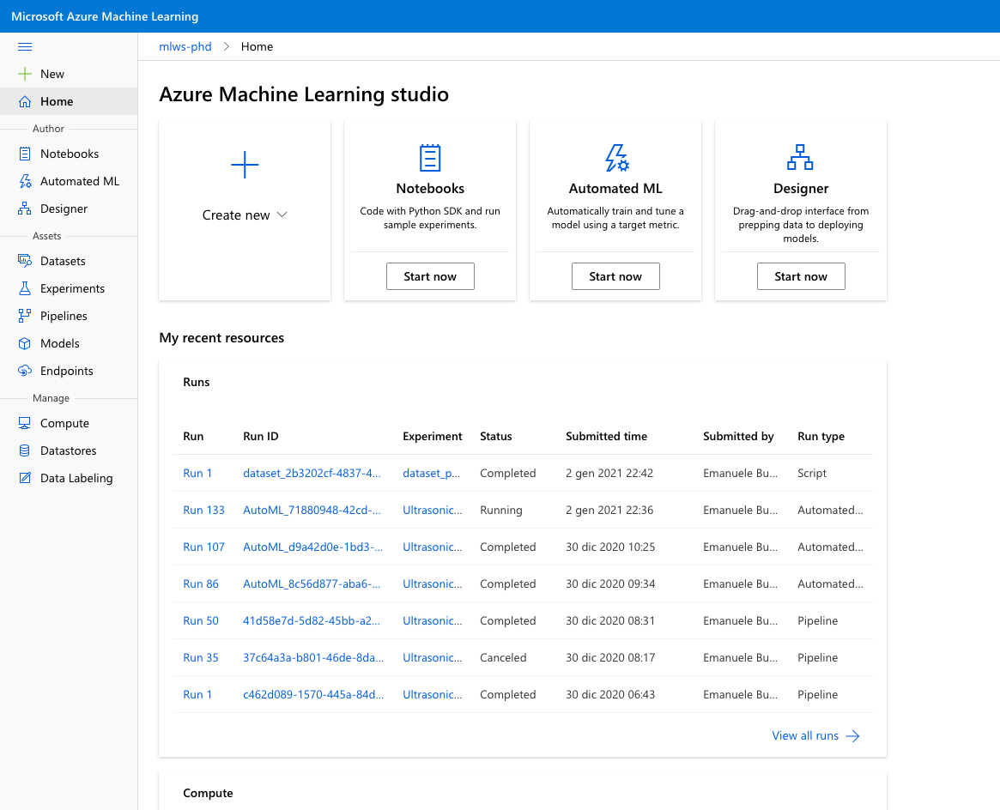

## Dataset

I file CSV prodotti dai vari esperimenti e dal [notebook "create training dataset"](../notebooks/create_training_dataset.ipynb) sono stati importati nel data storage in cloud e registrati come _Tabular Dataset_

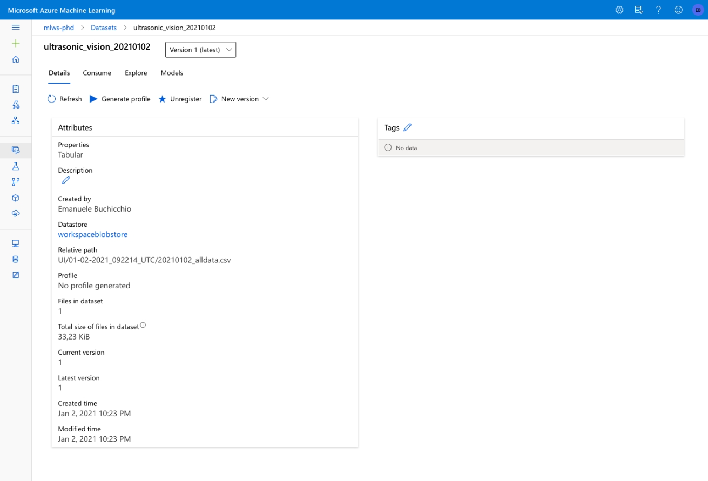

## Servizio Automated Machine Learning

Per sviluppare e pubblicare rapidamente un classificatore da utilizzare insieme al prototipo è stato utilizzato il servizio _Automated Machine Learning_ (AutoML). AutoML crea automaticamente delle _pipeline_ in cui venono applicate varie tecniche standard di feature engeneering e vengono addestrati modelli basati su un ampia gamma di algoritmi. Alla fine dell'esperimento il servizio seleziona il modello migliore rispetto alla metrica selezionata.

Tutti i risulati ottenuti nei diversi "run" generati dall'esperimento possono poi essere analizzati.

Per maggiori dettagli vedi notebook [ultrasonic-vision-train-automl](../notebooks/ultrasonic-vision-train-automl.ipynb)

### Risultati ottenuti

Nel caso specifico come metrica primaria è stata scelta _weighted AUC_ dato che il numero di campioni non era omogeneo per tutte le classi. Tra i vari modelli addestrati da _AutoML_ ho selezionato quello prodotto dalla pipeline "RobustScaler +  LightGBM".

Il modello non era stato selezionato come _best run_ da AutoML, Il modello presenta delle metriche di performance tutte molto alte 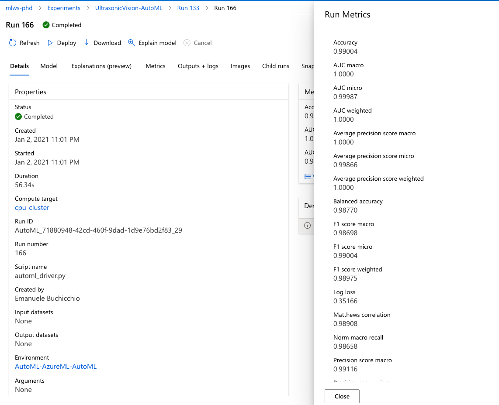 e rispetto a quelli proposti da AutoML è caratterizzato da un _calibration curve_ più "equlibrata".

[LightGBM](https://github.com/microsoft/LightGBM) è un algoritmo di classificaizone ad albero ad elevate prestazioni sviluppato da Microsoft e rilasciaot come open source.

Il modello addestrato e disponible nella cartella dei modelli  [AutoML71880948429.zip](../models/AutoML71880948429.zip)

### Metriche del modello

Di seguito un analisi dettagliata i parametri suggeriti nel  [documentazione di AutoML](https://docs.microsoft.com/en-us/azure/machine-learning/) con i punteggi ottenuti dal modello e i paragrafi applicabili del metodo di valutazione.

#### Confusion Matrix

Confusion matrices provide a visual for how a machine learning model is making systematic errors in its predictions for classification models. The word "confusion" in the name comes from a model "confusing" or mislabeling samples. A cell at row `i` and column `j` in a confusion matrix contains the number of samples in the evaluation dataset that belong to class `C_i` and were classified by the model as class `C_j`.

In the studio, a darker cell indicates a higher number of samples. Selecting **Normalized** view in the dropdown will normalize over each matrix row to show the percent of class `C_i` predicted to be class `C_j`. The benefit of the default **Raw** view is that you can see whether imbalance in the distribution of actual classes caused the model to misclassify samples from the minority class, a common issue in imbalanced datasets.

The confusion matrix of a good model will have most samples along the diagonal

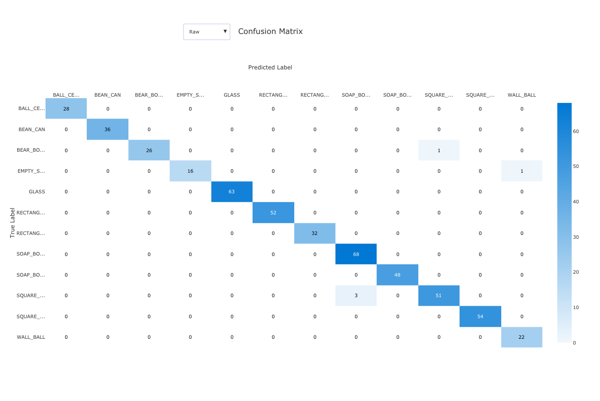

#### ROC curve

The receiver operating characteristic (ROC) curve plots the relationship between true positive rate (TPR) and false positive rate (FPR) as the decision threshold changes. The ROC curve can be less informative when training models on datasets with high class imbalance, as the majority class can drown out contributions from minority classes.

The area under the curve (AUC) can be interpreted as the proportion of correctly classified samples. More precisely, the AUC is the probability that the classifier ranks a randomly chosen positive sample higher than a randomly chosen negative sample. The shape of the curve gives an intuition for relationship between TPR and FPR as a function of the classification threshold or decision boundary.

A curve that approaches the top-left corner of the chart is approaching a 100% TPR and 0% FPR, the best possible model. A random model would produce an ROC curve along the `y = x` line from the bottom-left corner to the top-right. A worse than random model would have an ROC curve that dips below the `y = x` line.

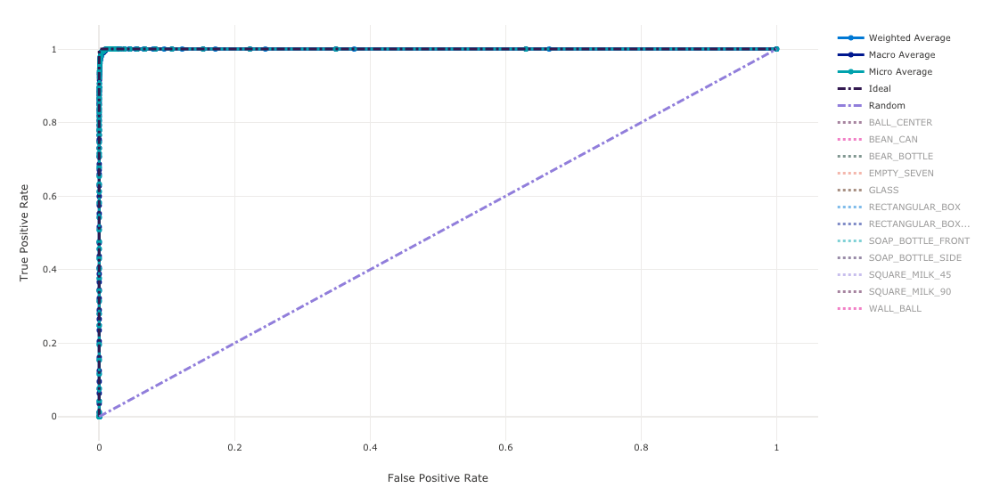

#### The precision-recall curve

The precision-recall curve plots the relationship between precision and recall as the decision threshold changes. Recall is the ability of a model to detect all positive samples and precision is the ability of a model to avoid labeling negative samples as positive. Some business problems might require higher recall and some higher precision depending on the relative importance of avoiding false negatives vs false positives.

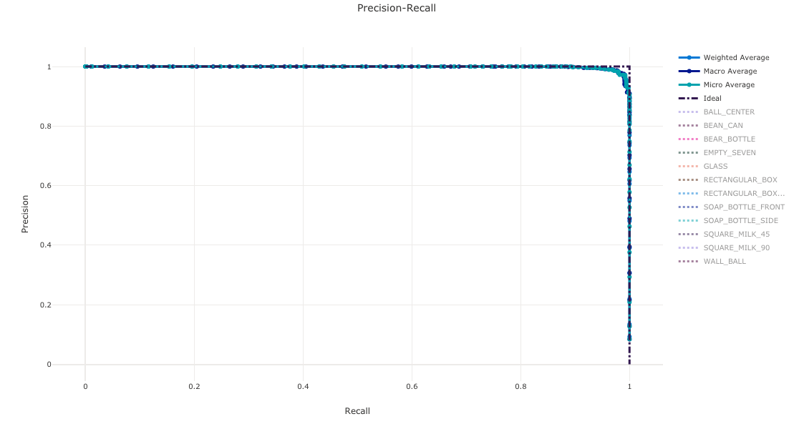

#### Cumulative gains curve

The cumulative gains curve plots the percent of positive samples correctly classified as a function of the percent of samples considered where we consider samples in the order of predicted probability.

To calculate gain, first sort all samples from highest to lowest probability predicted by the model. Then take `x%` of the highest confidence predictions. Divide the number of positive samples detected in that `x%` by the total number of positive samples to get the gain. Cumulative gain is the percent of positive samples we detect when considering some percent of the data that is most likely to belong to the positive class.

A perfect model will rank all positive samples above all negative samples giving a cumulative gains curve made up of two straight segments. The first is a line with slope `1 / x` from `(0, 0)` to `(x, 1)` where `x` is the fraction of samples that belong to the positive class (`1 / num_classes` if classes are balanced). The second is a horizontal line from `(x, 1)` to `(1, 1)`. In the first segment, all positive samples are classified correctly and cumulative gain goes to `100%` within the first `x%` of samples considered.

The baseline random model will have a cumulative gains curve following `y = x` where for `x%` of samples considered only about `x%` of the total positive samples were detected. A perfect model will have a micro average curve that touches the top-left corner and a macro average line that has slope `1 / num_classes` until cumulative gain is 100% and then horizontal until the data percent is 100.

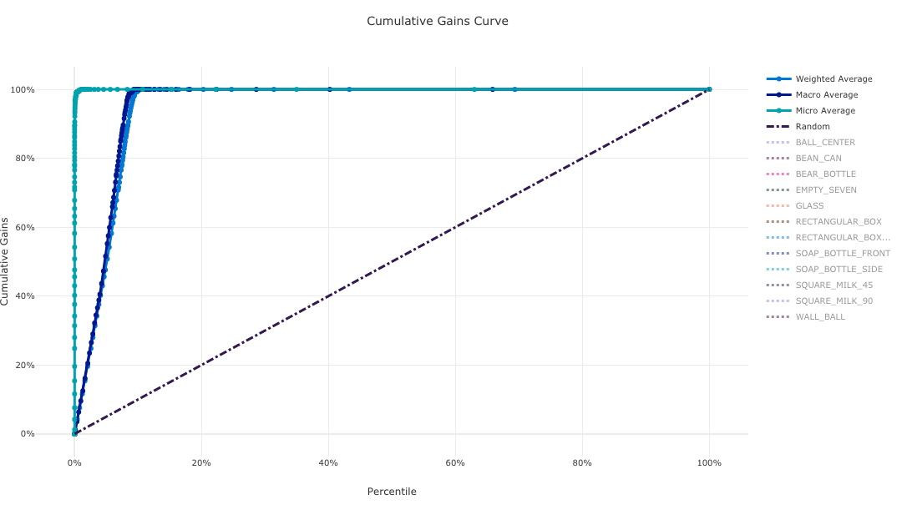

#### Lift curve

The lift curve shows how many times better a model performs compared to a random model. Lift is defined as the ratio of cumulative gain to the cumulative gain of a random model.

This relative performance takes into account the fact that classification gets harder as you increase the number of classes. (A random model incorrectly predicts a higher fraction of samples from a dataset with 10 classes compared to a dataset with two classes)

The baseline lift curve is the `y = 1` line where the model performance is consistent with that of a random model. In general, the lift curve for a good model will be higher on that chart and farther from the x-axis, showing that when the model is most confident in its predictions it performs many times better than random guessing.

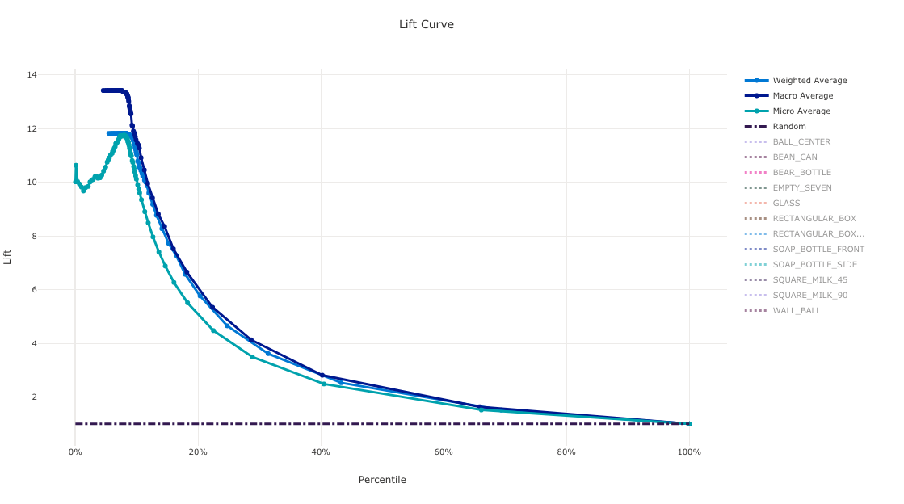

#### Calibration curve

Nota: questa è l'unica metrica non soddifacente dl modello analizzato. Un grafico molto lontano da quello del modello ideale che fa sospettare un problema di "overfitting"

The calibration curve plots a model's confidence in its predictions against the proportion of positive samples at each confidence level. A well-calibrated model will correctly classify 100% of the predictions to which it assigns 100% confidence, 50% of the predictions it assigns 50% confidence, 20% of the predictions it assigns a 20% confidence, and so on. A perfectly calibrated model will have a calibration curve following the `y = x` line where the model perfectly predicts the probability that samples belong to each class.

An over-confident model will over-predict probabilities close to zero and one, rarely being uncertain about the class of each sample and the calibration curve will look similar to backward "S". An under-confident model will assign a lower probability on average to the class it predicts and the associated calibration curve will look similar to an "S". The calibration curve does not depict a model's ability to classify correctly, but instead its ability to correctly assign confidence to its predictions. A bad model can still have a good calibration curve if the model correctly assigns low confidence and high uncertainty.

 Note

The calibration curve is sensitive to the number of samples, so a small validation set can produce noisy results that can be hard to interpret. This does not necessarily mean that the model is not well-calibrated.

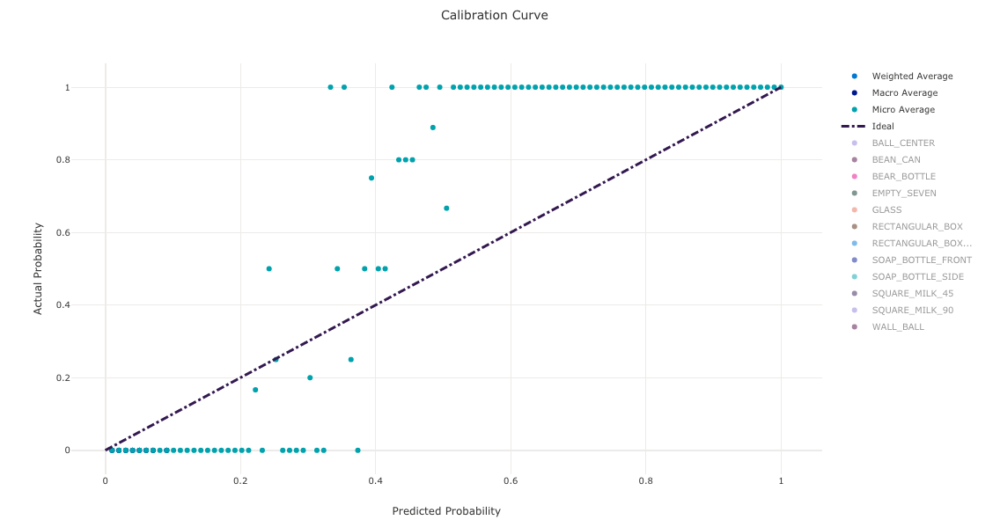

## Deploy come web service 

Il modello ottenuto tramite AutoML è stato poi pubblicato come webservice consumabile da parte del software presente a bordo del Raspberry. Il modello sarà eseguito all'interno di un container docker ed sarà accessibile tramite chiamata POST ad un endpoint REST. 

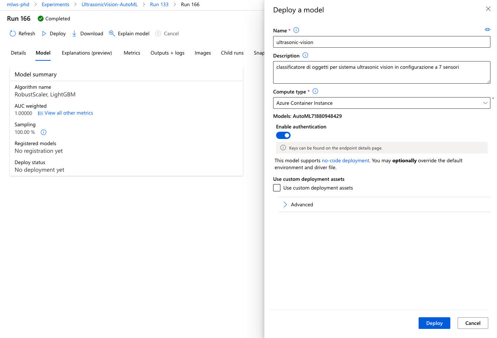

Endpoint: `http://64b32d7c-d926-4197-b807-1350e63adf7c.westeurope.azurecontainer.io/score`

Nota: Per l'utlizzo dell'endpoint è necessario includere nella chiamata le chiave di autenticazione.

## Azure ML SDK Installation

Azure Machine Learning può essere utilizzato  anche da ambiente di sviluppo locale. Per questo utilizzo è ncessario installare l'SDK

```shell
python -m pip install -U pip
pip install cryptography
pip install azureml-sdk
pip show azureml-core
```

Nota: la versione deve essere **la stessa** di quella usata nel workspace su AzureML per evitare problemi di copatibilità


Per maggiori informazioni fare riferimento alla documentazione online
[Install the Azure Machine Learning SDK for Python - Azure Machine Learning Python | Microsoft Docs](https://docs.microsoft.com/en-us/python/api/overview/azure/ml/install?view=azure-ml-py)

