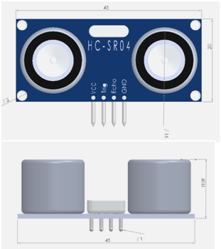
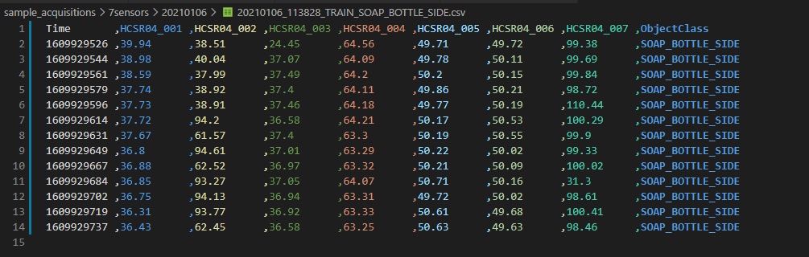
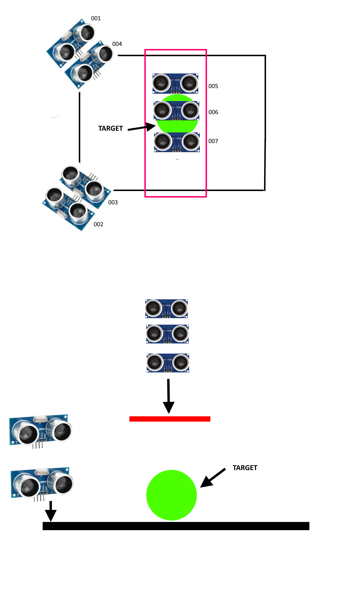

# Il prototipo realizzato (versione 1.0)

## Scopo

Testare possibilità di stimare la posizione di un oggetto e riconoscere il tipo di oggetto utilizzando un numero limitato di sensori

## Requisiti 

1. il sistema deve riuscire a stimare la posizione di un oggetto all'interno di un area delimitata
2. il sistema deve riconoscere il tipo di oggetto presente (classificazione muticlasse)
3. utilizzare HW standard, a basso costo e facilmente reperibile. Possibilmente solo moduli già pronti, senza schede custom.
4. il sistema deve essere documentato e riproducibile. Ad esempio per esercitazioni di laboratorio.  

## Hardware

Prototipo realizzato con Raspberry PI 3 e sensori HC-SR04. Software completamente open source. Costo complessivo  hardaware  inferiore a 50€. Tutti i componenti facilmente reperibili dai rivenditori di elettronica oppure su Amazon eBay e simili.

Nota: Ogni sensore richiede GND, VCC + 2 GPIO (trigger + echo). Su Raspberry 2 ci sono 24 GPIO pin disponibili => questo sistema può supportare  fino a 12 sensori.

Software scritto in Python facile da scrivere, mantenere e debuggare direttamente sul Raspberry senza bisogno di altri ambienti di sviluppo. Include sistema di "simulazione" dei sensori delle libreria GPIO che non è presente nel normali PC in modo da permettere l'esecuzione ed il debug anche senza avere accesso all'hardware. 

## Misuratori ad ultrasuoni

Sul mercato esistono diversi misuratori di distanza ad ultrasuoni, destinati al mercato dei maker,  con funzionalità e prestazioni sostanzialmente equivalenti. Per il prototipo sono stati utilizzati misuratori di distanza ad ultrasuoni tipo [HC-SR04/SR04+](https://www.alldatasheet.com/datasheet-pdf/pdf/1132203/ETC2/HC-SR04.html) che erano disponibili in laboratorio.

Si tratta di moduli standard, realizzati e distribuiti da diversi fornitori, facilmente reperibili sul mercato al costo indicativo di 2-3€.




Carattristiche HC-SR04

- Operating voltage: +5V
- Theoretical Measuring Distance: 2cm to 450cm
- Practical Measuring Distance: 2cm to 80cm
- Accuracy: 3mm
- Measuring angle covered: <15°
- Operating Current: <15mA
- Operating Frequency: 40Hz

### Pinout HC-RS04

I moduli sono dotati di interfaccia standard a 4 pin utilizzata da molti sensori


| **Pin Number** | **Pin Name** | **Description**                                              |
| -------------- | ------------ | ------------------------------------------------------------ |
| 1              | Vcc          | The Vcc pin powers the sensor, typically with +5V            |
| 2              | Trigger      | Trigger pin is an Input pin. This pin has to be kept high for 10us to initialize measurement by sending US wave. |
| 3              | Echo         | Echo pin is an Output pin. This pin goes high for a period of time which will be equal to the time taken for the US wave to return back to the sensor. |
| 4              | Ground       | This pin is connected to the Ground of the system.           |

## Software

Il software di controllo del sistema di misura è stato sviluppato in Python 3. Lo script principale da eseguire sul sistema in produzione è l'applicazione console  [ultrasonic-vision.py](..\src\ultrasonic-vision.py) 

```bash
ultrasonic-vision.py <key> <scoring-uri> [<training-label>]
```

| Parametro      | Descrizione                                                  |
| -------------- | ------------------------------------------------------------ |
| key            | API key per l'utilizzo del webservice REST che esegue il modello di classificazione. **Obbligatorio. ** |
| scoring-uri    | URI dell'endpoint pubblico del webservice REST del classificatore. **Obbligatorio **. |
| training-label | Label associata alle distanze stimate dai sensori. Se questo parametro è presente l'applicazione funziona in modalità _addestramento_. **Opzionale**. |

L'applicazione può essere usata in tre modalità:

1. **modalità addestramento** in cui viene passato come parametro la "label" associata all'oggetto presente all'interno dell'area di rilevamento

   ```bash
   ultrasonic-vision.py asc12345567789 http://webserviceurl.azure.com/123-456-5567/score BALL
   ```

2. **modalità riconoscimento** (produzione) in cui è il modello di classificazione ad assegnare la label in base alle distanze stimate dai sensori

   ```bash
   ultrasonic-vision.py asc12345567789 http://webserviceurl.azure.com/123-456-5567/score
   ```

3. **modalità riconoscimento con hardware simulato**  in cui è il modello di classificazione ad assegnare la label in base, ma le stime delle distanze sono generate in maniera randomica.

```bash
ultrasonic-vision.py asc12345567789 http://webserviceurl.azure.com/123-456-5567/score
```

Questa modalità consente di eseguire l'applicazione su PC che non dispongono di periferiche di I/O digitale compatibili con la libreria GPIO presente nell'ambiente di runtime Python su Raspberry. Gli errori a runtime legati al modulo RPi.GPIO vengono evitati sostituendo il modulo originale con un smeplice mockup creato per questo scopo denominato FakeRPi.GPIO

Per attivare la modalità simulazione decommentare l'import del modulo FakeRPi.GPIO

```python
# import FakeRPi.GPIO as GPIO # real hardware sensors
```

e commentare quello della libreria reale

```python
import RPi.GPIO as GPIO #emulated sensors
```

### Modalità riconoscimento

Nella modalità riconoscimento l'applicazione svolge i seguenti compiti:

1. crea un file su disco locale per il salvataggio dei dati
2. entra in un loop infinito in cui se le l'interruttore di avvio  è chiuso esegue una misura
   1. inizializza i sensori
   2. acquisisce le stime della distanza del bersaglio restituita dai diversi sensori
   3. Stampa sulla console le distanze stimate dai sensori
   4. esegue la chiamata al web service del servizio  di classificazione degli oggetti in cloud e stampa sulla console il risultato
   5. esegue localmente il classificatore utilizzando le API Python del Runtime ONNX e stampa sulla console il risultato
   6. scrive le distanze e il risultato della classificazione sul file della sessione di acquisizione dati 

### Modalità Addestramento

Nella modalità addestramento l'applicazione svolge i seguenti compiti:

1. crea un file su disco locale per il salvataggio dei dati
2. entra in un loop infinito in cui se le l'interruttore di avvio  è chiuso esegue una misura
   1. inizializza i sensori
   2. acquisisce le stime della distanza del bersaglio restituita dai diversi sensori
   3. Stampa sulla console le distanze stimate dai sensori
   4. scrive le distanze e la label passata come parametro sul file della sessione di acquisizione dati

### Gestione avvio della misurazione

MAIN_TRIGGER_GPIO = 26


   while True:
        if(FAKE_HW):
            mainTriggerState= True       
        else:
            mainTriggerState= GPIO.input(MAIN_TRIGGER_GPIO)


[Gestione evento "pulsante premuto" su Raspberry](docs/raspberry_button_pressed.md)

### Dati Prodotti da sistema di misura

L'applicazione  [ultrasonic-vision.py](..\src\ultrasonic-vision.py)  produce file in formato CSV. Ogni riga corrisponde ad una misura e contiene le seguenti informazioni:

- timestamp (in formato unix epoch) del inizio delle misura (tipo numerico intero)
- una colonna per ogni sensore presente contenente la distanza stimata in cm arrotondata alla seconda cifra decimale
- la label di classificazione associata alla misura



## Configurazione a sette sensori

Durante la realizzazione del prototipo sono state ipotizzate e testate diverse configurazioni geometriche.   L'acquisizione dei dati utilizzati per l'addestramento del classificatore è stata eseguita nella configurazione a sette sensori con quattro sensori montati su due pannelli verticali orientati verso il centro dell'area di rilevamento e tre sensori montati sul pannello orizzontale posizionato al di sopra l'area di rilevamento.

La portata utile dei sensori utilizzati è di circa 3 metri. Per ragioni logistiche la configurazione usata per l'addestramento ed il test è stata assemblata su una base di 40 x 70 cm in modo da rendere il  sistema facilmente  trasportabile.




[Test della configurazione a sette sensori](docs/seven_sensors_configuration_test.md)

## Assemblaggio e cablatura

*Nota: per la descrizione delle attività di assemblaggio e cablatura vedi  [activity_log.md](..\activity_log.md)* 

## Posizionamento degli oggetti e dataset di training

## Dati training 3D

Ogni oggetto è stato posto approssimativamente al centro dell'altra di acquisizione dati, senza utilizzare riferimenti precisi per la posizione con lo scopo di rendere più robusto il riconoscimento da parte del classificatore. Per ogni oggetto acquisizione dati è stata ripetuta più volte dopo aver tolto e posizionato nuovamente l'oggetto con variazioni casuali di posizionamento. 

### Posizionamento oggetti

Sono stati sperimentati diversi posizionamenti degli oggetti all'interno del range dei sensori.  I dati di training del classificatore sono stati acquisiti posizionando gli oggetti nella zona centrale on modo da avere potenzialmente letture significative da tutti sensori presenti (compresi quelli ora non presenti nella configurazione a sette sensori)


Acquisizione second dataset di training con configurazione  a sette sensori e barriere parallele ai piani dei sensori

- SQUARE_MILK_90 
- SQUARE_MILK_45 

- BEAN_CAN 
- SOAP_BOTTLE_FRONT 
- SOAP_BOTTLE_SIDE 
- GLASS 
- RECTANGULAR_BOX  
- RECTANGULAR_BOX_SIDE 
- WALL_BALL 
- BALL_CENTER 
- BEER_BOTTLE 

Ogni oggetto è stato posto approssimativamente al centro dell'altra di acquisizione dati, senza utilizzare riferimenti precisi per la posizione con lo scopo di rendere più robusto il riconoscimento da parte del classificatore. Per ogni oggetto l'acquisizione dati è stata ripetuta più volte dopo aver tolto e posizionato nuovamente l'oggetto con variazioni casuali di posizionamento. 


